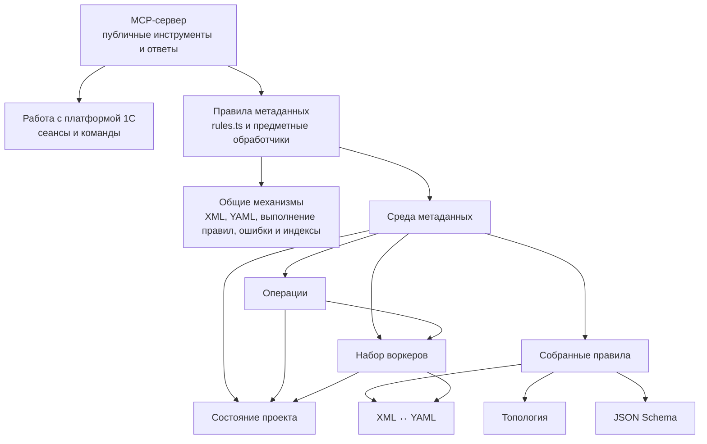
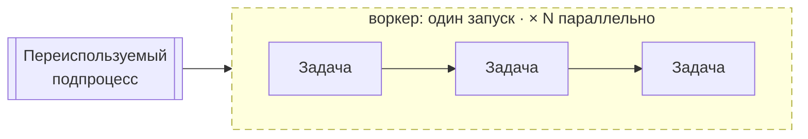
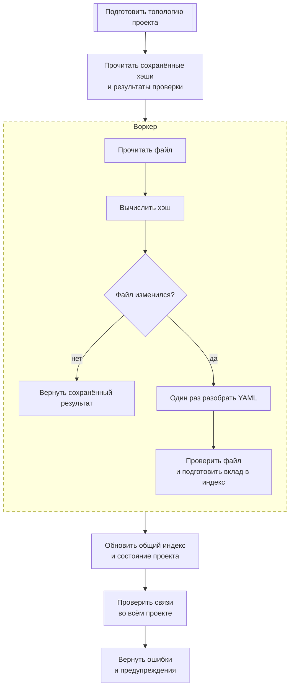
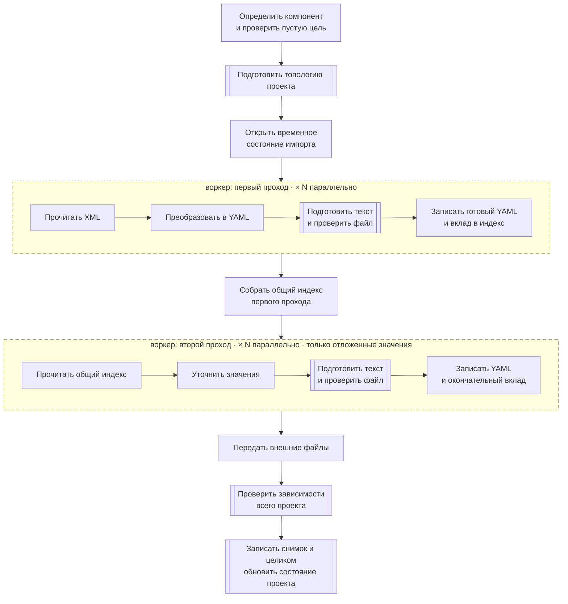
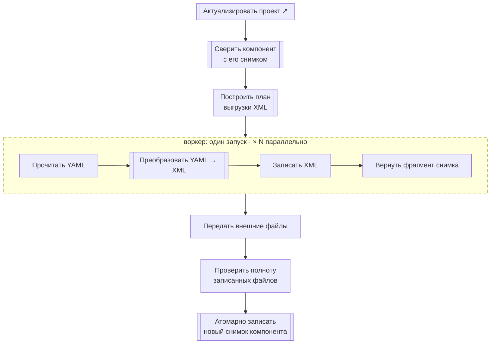
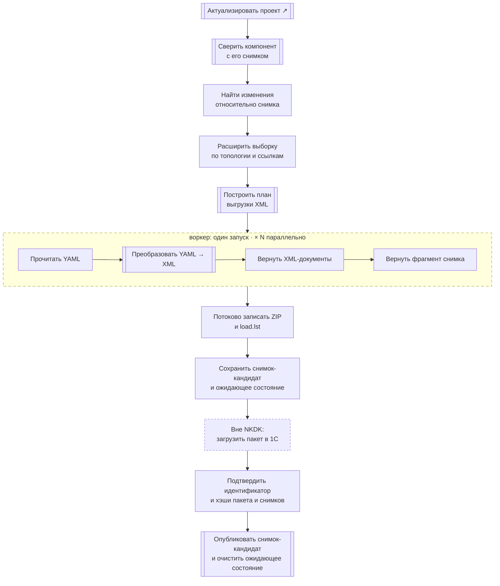
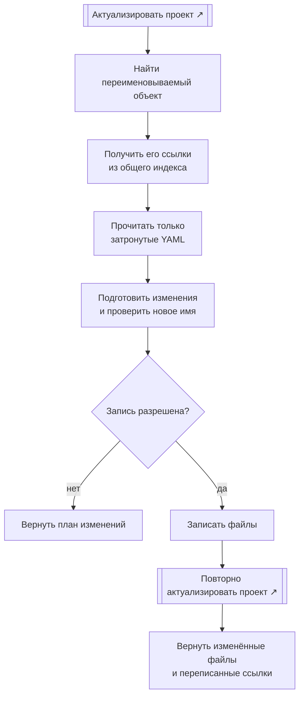
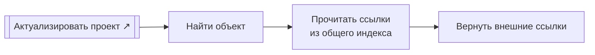

# Архитектура NKDK

Этот файл — монитор текущей архитектуры. Он меняется вместе с кодом и не хранит историю или подробные договоры реализации: история остаётся в git.

## Принципы

| Принцип | Проверяемое следствие |
|---|---|
| XML ↔ YAML без потерь | Поддержанный XML проходит `XML → YAML → XML` без потери содержимого. Если исходную форму нельзя однозначно восстановить, в YAML сохраняется исходный фрагмент XML с пометкой [`!xml`](#exception-xml). Каждое новое место для такой пометки согласуется отдельно. |
| Один канонический YAML | Одному содержимому XML соответствует одна форма YAML. Повторная выгрузка приводит совместимые входные варианты к этой форме; избыточные значения, совпадающие с выводимыми, в неё не входят. |
| Проверка за секунды | Неизменённые YAML повторно не разбираются. Изменённые файлы обрабатываются параллельно, а общие индексы переиспользуются между операциями. |
| YAML содержит только значимое | Очевидные значения выводятся из контекста: например, синоним `Заказ покупателя` для имени `ЗаказПокупателя` и `ПутьКДанным` вида `<ОсновнойРеквизит>.<ИмяЭлемента>`. |
| Архитектура видна целиком | В документе остаются только термины, границы, переиспользование и схемы основных операций. Детали находятся в коде и тестах. |

### Пометка `!xml`

- хранит только ту часть исходного XML, которую нельзя восстановить из обычных полей YAML;
- её содержимое не проверяется и не показывается в JSON Schema;
- место применения проверяется: `!xml` разрешён только там, где это отдельно согласовано.

## Термины

Иерархия схем NKDK: [операция](#term-operation) → [процесс](#term-process) → [подпроцесс](#term-subprocess) или [задача](#term-task). Внутри процесса используются понятия [BPMN 2.0.2](https://www.omg.org/spec/BPMN/2.0.2/): подпроцесс можно раскрыть подробнее, задача на текущей схеме неделима.

| Термин | Значение |
|---|---|
| Операция | Команда пользователя с законченным результатом: импорт, проверка, синхронизация, переименование или поиск ссылок. Запускает один процесс. |
| Процесс | Полный ход выполнения операции от входных данных до результата. Состоит из подпроцессов и задач. |
| Подпроцесс | Именованная часть процесса, которую можно раскрыть отдельной схемой и переиспользовать в разных процессах. |
| Задача | Наименьшая показанная единица работы. На текущем уровне схема не раскрывает её внутреннее устройство. |
| Запуск воркера | Граница выполнения нескольких задач одним воркером над одним элементом или пачкой. Это способ выполнения, а не уровень иерархии. |
| Проект | YAML-представление конфигурации и связанные внешние файлы. |
| Компонент | Самостоятельная часть проекта: `cf`, `cfe/<Имя>`, `erf/<Имя>` или `epf/<Имя>`. |
| Правила | Декларативное описание соответствия XML, модели, YAML, структуры файлов и схем. |
| Топология | Составленная из правил карта YAML, XML и внешних файлов компонента. |
| Среда метаданных | Собранные для одного процесса правила, проверки, операции, состояние проекта и набор воркеров. |
| Состояние проекта | Восстанавливаемые хэши, результаты проверки отдельных файлов и общие индексы всего проекта. В памяти публикуется неизменяемыми общими буферами. |
| Снимок компонента | Двоичный результат импорта или синхронизации: хэши файлов и сведения, необходимые для точного восстановления XML. |
| Проверка файла | Проверка синтаксиса, JSON Schema и правил, зависящих только от одного YAML. |
| Проверка связей | Проверка межфайловых ссылок по общему индексу всего проекта. |

## Карта компонентов

Общие механизмы не знают о конкретных объектах метаданных. Предметные правила зависят от общих механизмов, а не наоборот. Все правила и обработчики связываются в одном месте при запуске.

## Переиспользование

| Подпроцесс | [Импорт](#operation-import) | [Проверка](#operation-validation) | [Полная синхронизация](#operation-full-sync) | [Частичная синхронизация](#operation-partial-sync) | [Переименование](#operation-rename) | [Поиск ссылок](#operation-find-references) |
|---|:---:|:---:|:---:|:---:|:---:|:---:|
| [Подготовка топологии](#term-topology) | ● | ● | ● | ● | ● | ● |
| [Актуализация проекта](#subprocess-refresh) |  | ● | ● | ● | ● | ● |
| Сверка со [снимком компонента](#term-snapshot) |  |  | ● | ● |  |  |
| Подготовка выгрузки XML |  |  | ● | ● |  |  |
| YAML → XML |  |  | ● | ● |  |  |

## Обозначения схем

- двойная рамка — [подпроцесс](#term-subprocess), переиспользуемый в нескольких процессах; крупные подпроцессы раскрываются отдельно;
- пунктирная рамка — [граница одного запуска воркера](#term-worker-run); `× N` означает параллельное выполнение таких запусков;
- прямоугольник — [задача](#term-task);
- до четырёх последовательных задач схема идёт слева направо, от пяти — сверху вниз.

## Общий подпроцесс: актуализация проекта

Этот [подпроцесс](#term-subprocess) приводит [состояние проекта](#term-state) в соответствие с файлами и возвращает ошибки и предупреждения.

## [Операции](#term-operation)

### Импорт XML → YAML

### Проверка проекта

↳ [Актуализация проекта — подробная схема](#subprocess-refresh)

### Полная синхронизация YAML → XML

↳ [Актуализация проекта — подробная схема](#subprocess-refresh)

### Частичная синхронизация YAML → XML

↳ [Актуализация проекта — подробная схема](#subprocess-refresh)

### Переименование

↳ [Актуализация проекта — подробная схема](#subprocess-refresh)

### Поиск ссылок

↳ [Актуализация проекта — подробная схема](#subprocess-refresh)
