# Архитектура NKDK

Этот файл — монитор текущей архитектуры и явно согласованных целевых схем ближайшей реализации. Он не хранит историю или подробные договоры реализации: история остаётся в git.

## Принципы

| Принцип | Проверяемое следствие |
|---|---|
| XML ↔ YAML без потерь | Поддержанный XML проходит `XML → YAML → XML` без потери содержимого. Необратимая XML-форма сохраняется общим `!xml/raw`; обратимая форма может храниться кратким тегом, явно зарегистрированным для точного типа свойства или элемента, например `!xml/standard-attributes`, `!xml/string` или `!xml/name`; обратимые смысловые ошибки сохраняются `!xml/invalid` или явно зарегистрированным `!xml/important`. Договор перечислен в [реестре XML-аномалий](xml-anomalies.md). |
| Один канонический YAML | Одному содержимому XML соответствует одна форма YAML. Повторная выгрузка приводит совместимые входные варианты к этой форме; избыточные значения, совпадающие с выводимыми, в неё не входят. |
| Проверка за секунды | Неизменённые YAML повторно не разбираются. Изменённые файлы обрабатываются параллельно, а общие индексы переиспользуются между операциями. |
| YAML содержит только значимое | Очевидные значения выводятся из контекста: например, синоним `Заказ покупателя` для имени `ЗаказПокупателя` и `ПутьКДанным` вида `<ОсновнойРеквизит>.<ИмяЭлемента>`. |
| Преобразования YAML сохраняют контекст | Поверхностная копия того же смыслового YAML-узла переносит все служебные метаданные единым механизмом runtime. Аннотации всего дерева переносятся отдельно вместе с соответствием исходных и целевых узлов. |
| Архитектура видна целиком | В документе остаются только термины, границы, переиспользование и схемы основных операций. Детали находятся в коде и тестах. |

## Термины

Иерархия схем NKDK: [операция](#term-operation) → [процесс](#term-process) → [подпроцесс](#term-subprocess) или [задача](#term-task). Внутри процесса используются понятия [BPMN 2.0.2](https://www.omg.org/spec/BPMN/2.0.2/): подпроцесс можно раскрыть подробнее, задача на текущей схеме неделима.

| Термин | Значение |
|---|---|
| Операция | Команда пользователя с законченным результатом: импорт, проверка, синхронизация, переименование или поиск ссылок. Запускает один процесс. |
| Процесс | Полный ход выполнения операции от входных данных до результата. Состоит из подпроцессов и задач. |
| Подпроцесс | Именованная часть процесса, которую можно раскрыть отдельной схемой и переиспользовать в разных процессах. |
| Задача | Наименьшая показанная единица работы. На текущем уровне схема не раскрывает её внутреннее устройство. |
| Запуск воркера | Граница выполнения нескольких задач одним воркером над одним элементом или пачкой. Это способ выполнения, а не уровень иерархии. |
| Проект | YAML-представление конфигурации и связанные внешние файлы. |
| Компонент | Самостоятельная часть проекта: `cf`, `cfe/<Имя>`, `erf/<Имя>` или `epf/<Имя>`. |
| Правила | Декларативное описание соответствия XML, модели, YAML, структуры файлов и схем. |
| Топология | Составленная из правил карта YAML, XML и внешних файлов компонента. |
| Среда метаданных | Собранные для одного процесса правила, проверки, операции, состояние проекта и набор воркеров. |
| Состояние проекта | Восстанавливаемые хэши, результаты проверки отдельных файлов и общие индексы всего проекта. В памяти публикуется неизменяемыми общими буферами. |
| Снимок компонента | Компонентное LMDB-хранилище: хэши файлов и отдельные двоичные блоки сведений, необходимых для точного восстановления XML. |
| Проверка файла | Проверка синтаксиса, JSON Schema и правил, зависящих только от одного YAML. |
| Проверка связей | Проверка межфайловых ссылок по общему индексу всего проекта. |
| Служебные метаданные YAML | Невидимые сведения узла, необходимые для точного преобразования: форма скаляров, порядок ключей и внутренние привязки к XML. Они не входят в публичные поля YAML и сохраняются общим механизмом при копировании того же смыслового узла. |

## Карта компонентов

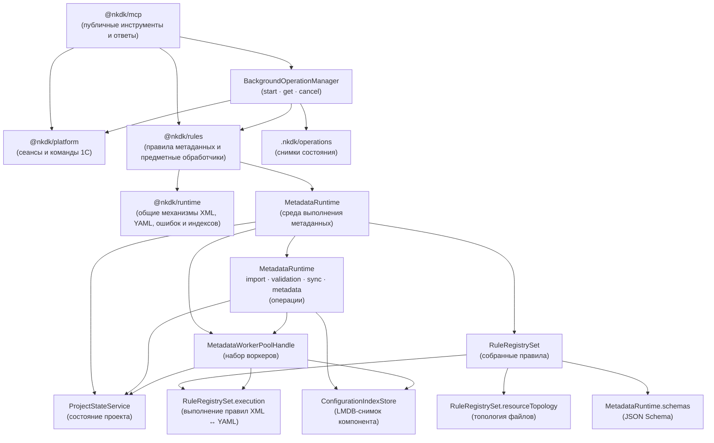

Общие механизмы не знают о конкретных объектах метаданных. Предметные правила зависят от общих механизмов, а не наоборот. Все правила и обработчики связываются в одном месте при запуске.

| Пакет | Ответственность в частичной синхронизации с информационной базой |
|---|---|
| `@nkdk/rules` | Актуализация Проекта, план XML, ZIP, подготовленный снимок и состояние передачи |
| `@nkdk/platform` | Сессия агента, служебные копии ZIP и списка загрузки, команда 1С, результат передачи и журнал платформы |
| `@nkdk/mcp` | Последовательность операции и публичный ответ |

Длительные MCP-инструменты запускаются через один `BackgroundOperationManager` на процесс. Инструмент возвращает `operationId` после сохранения состояния `queued`; отдельные `get_operation` и `cancel_operation` читают состояние и управляют собственным `AbortSignal` операции. Сигнал исходного MCP-запроса после принятия задания на него не влияет. Типизированный реестр связывает виды операций с обычными сервисами MCP, поэтому бизнес-логика остаётся синхронно тестируемой вне транспорта.

Клиент длительной операции сохраняет MCP-сессию после ответа `accepted` и
опрашивает `get_operation` до терминального состояния. Следующая зависимая
операция запускается только после `succeeded` и проверки вложенного результата;
`failed`, `cancelled` и `interrupted` являются ошибками процесса. Локальные
round-trip и profile-runner используют этот же договор, поэтому время и
diagnostics относятся к выполненной операции, а не к принятию задания.

Снимки хранятся атомарно в `.nkdk/operations`. Входные параметры и секреты туда не записываются. После перезапуска активные записи переходят в `interrupted` без автоматического повтора, а терминальные записи удаляются через 30 дней. Один процессный диспетчер используется всеми экземплярами HTTP и stdio-сервера; при завершении процесса он отменяет задания до закрытия runtime и соединений платформы.

## Переиспользование

| Подпроцесс | [Импорт](#operation-import) | [Проверка](#operation-validation) | [Полная синхронизация](#operation-full-sync) | [Частичная синхронизация с информационной базой](#operation-partial-sync) | [Переименование](#operation-rename) | [Поиск ссылок](#operation-find-references) |
|---|:---:|:---:|:---:|:---:|:---:|:---:|
| [Подготовка топологии](#term-topology) | ● | ● | ● | ● | ● | ● |
| [Проверка YAML и подготовка вклада в индекс](#subprocess-yaml-index) | ● | ● | ● | ● | ● | ● |
| Публикация [состояния проекта](#term-state) | ● | ● | ● | ● | ● | ● |
| [Проверка связей проекта](#subprocess-reference-check) | ● | ● | ● | ● | ● | ● |
| [Актуализировать проект](#subprocess-refresh) |  | ● | ● | ● | ● | ● |
| Сверка со [снимком компонента](#term-snapshot) |  |  | ● | ● |  |  |
| [Подготовить профиль восстановления XML компонента](#subprocess-xml-reconstruction-profile) | ● |  | ● | ● |  |  |
| Подготовка выгрузки XML |  |  | ● | ● |  |  |
| YAML → XML |  |  | ● | ● |  |  |

## Обозначения схем

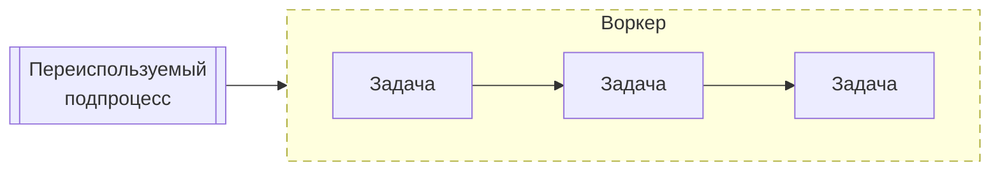

- двойная рамка — [подпроцесс](#term-subprocess), переиспользуемый в нескольких процессах; крупные подпроцессы раскрываются отдельно;
- пунктирная рамка — [граница одного запуска воркера](#term-worker-run);
- прямоугольник — [задача](#term-task);
- до четырёх последовательных задач схема идёт слева направо, от пяти — сверху вниз.

## Общие подпроцессы

### Прочитать и изменить снимок компонента

Снимок каждого компонента хранится в отдельном LMDB environment. Таблица
`hashes` позволяет искать изменения без чтения крупных значений, а `blocks`
содержит самостоятельные двоичные блоки только для YAML-файлов с сохраняемыми
идентификаторами или XML-сведениями. Worker открывает снимок только для чтения
и получает блоки известных ему файлов; полный снимок между процессами не
передаётся.

Только координатор операции пишет LMDB. Полная публикация заменяет все активные
ключи одной транзакцией, частичная — только ключи подготовленной дельты.
Черновик partial sync находится в отдельных `pending*`-таблицах того же
environment и не виден обычным читателям. LMDB сохраняет старое согласованное
состояние для уже начавшихся read-транзакций.

### Проверить YAML и подготовить вклад в индекс

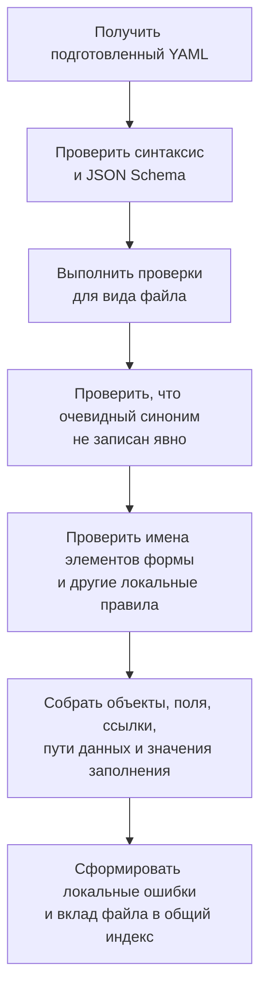

### Подготовить профиль восстановления XML компонента

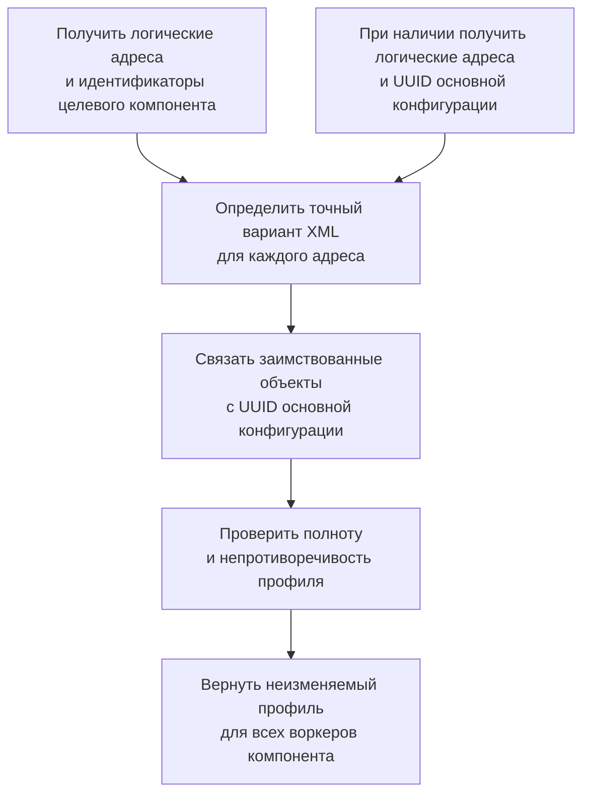

Подпроцесс одинаково классифицирует объекты при контрольном экспорте импорта и
при обычной синхронизации. Он работает с уже прочитанными сведениями индексов,
не открывает LMDB и не читает XML/YAML. Для каждого адреса материализуется
точный вариант `full`, `adopted` или `indexed`; обязательный UUID
заимствованного объекта проверяется до запуска экспорта.
Экспортные правила получают принадлежность текущего логического адреса из этого
профиля, а не выводят её из вида компонента. Это симметрично локальному
`full`/`adopted`-контексту XML-import; вариант `indexed` остаётся отдельным
вариантом обычной конфигурации и не приравнивается к `adopted`.

### Проверить связи проекта

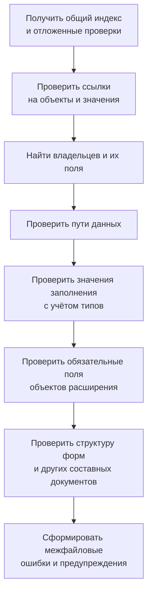

Структурный документ может передавать вместе с адресными фактами переносимое
смысловое представление в непрозрачном строковом `payload`. ProjectState
сохраняет, дедуплицирует и возвращает это значение, но не интерпретирует его.
Сериализация, разбор, проекция и межфайловое сравнение принадлежат concrete-модулю,
зарегистрировавшему проверку документа. Все связанные представления такая
проверка получает из одного подтверждённого снимка ProjectState и не перечитывает
YAML с диска.

### Актуализировать проект

Этот [подпроцесс](#term-subprocess) приводит [состояние проекта](#term-state) в соответствие с файлами и возвращает ошибки и предупреждения.

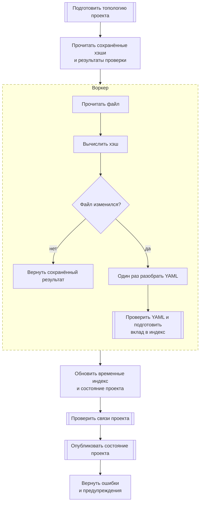

↳ [Проверка YAML и подготовка вклада в индекс — подробная схема](#subprocess-yaml-index)

↳ [Проверить связи проекта — подробная схема](#subprocess-reference-check)

## [Операции](#term-operation)

### Импорт XML → YAML

```mermaid
flowchart TD
  root["Прочитать корневой XML"]
  target["Определить вид и путь компонента"]
  preflight["Проверить целевой каталог<br/>и отсутствие незавершённой синхронизации"]
  topology[["Подготовить топологию проекта"]]
  extension{"Импортируется расширение?"}
  refresh[["Актуализировать проект"]]
  session["Открыть временное<br/>состояние импорта"]
  discover["Найти XML и внешние файлы<br/>и сформировать задания"]

  subgraph first["Первый проход воркера"]
    direction TD
    readXml["Один раз прочитать полный XmlDocument<br/>и потоково вычислить хэши"] --> itemVariant["До свойств определить вариант<br/>текущего metadata item"]
    itemVariant --> facts["По rules.ts собрать только факты<br/>индексов и зависимостей"]
    facts --> pack["Упаковать XmlDocument<br/>в MessagePack"]
    pack --> retain["Сохранить буфер<br/>локально в worker"]
    retain --> firstResult["Вернуть факты, внешние файлы<br/>и части состояния"]
  end

  firstErrors{"Есть ошибки?"}
  snapshotFragments["Собрать сведения из XML<br/>для снимка компонента"]
  index["Зафиксировать глобальные индексы<br/>метаданных и зависимостей"]
  profile[["Подготовить профиль<br/>восстановления XML компонента"]]

  subgraph second["Второй проход того же воркера"]
    direction TD
    unpack["Распаковать сохранённый XmlDocument"] --> resolve["Построить окончательный YAML<br/>с глобальными индексами"]
    resolve --> proof["Выполнить toXML в памяти<br/>и сравнить структурные хэши"]
    proof --> detail["Только при различии сравнить ветви<br/>и построить минимальные raw"]
    detail --> local2[["Проверить YAML и подготовить<br/>окончательный вклад"]]
    local2 --> serialize2["Записать окончательный YAML"]
    serialize2 --> release["Освободить packed buffer<br/>и объектные деревья"]
  end

  secondErrors{"Есть ошибки?"}
  semanticIndex["Зафиксировать окончательный индекс<br/>и проверить оставшиеся связи"]
  files["Объединить списки<br/>созданных файлов"]
  external["Передать внешние файлы<br/>и вычислить их хэши"]
  externalState["Добавить внешние файлы<br/>во временное состояние"]
  snapshot["Последовательно записать блоки<br/>во временную LMDB"]
  dependencies[["Проверить связи проекта"]]
  writeSnapshot["Опубликовать LMDB-снимок компонента"]
  publish[["Опубликовать состояние проекта"]]
  result["Вернуть результат импорта,<br/>ошибки и предупреждения"]
  abort["Отменить временное состояние<br/>и закрыть воркеры"]
  failure["Вернуть ошибки импорта"]

  root --> target --> preflight --> topology --> extension
  extension -- "нет" --> session
  extension -- "да" --> refresh --> session
  session --> discover --> first --> firstErrors
  firstErrors -- "нет" --> snapshotFragments --> index --> profile --> second --> secondErrors
  secondErrors -- "нет" --> semanticIndex --> files --> external --> externalState --> snapshot --> dependencies --> writeSnapshot --> publish --> result
  firstErrors -- "да" --> abort
  secondErrors -- "да" --> abort
  abort --> failure
  style first stroke-dasharray: 7 5
  style second stroke-dasharray: 7 5
```

Полный `XmlDocument` живёт между проходами как worker-local MessagePack-буфер:
он не передаётся координатору и не копируется между worker. Второй проход
назначается тому же worker, распаковывает документ, строит YAML с уже готовым
глобальным индексом и освобождает буфер сразу после записи задания. Поэтому XML
с диска читается один раз, а одновременно распакованной остаётся только
ограниченная пачка заданий.

Контрольный экспорт сравнивает структурные хэши исходного `XmlDocument` и
объектного результата toXML. При несовпадении адресуемое экспортированное дерево
строится непосредственно из объекта, после чего сравнение спускается только в
различающиеся ветви. XML-строка и повторный parse для этой проверки не нужны.

При XML → YAML зарегистрированное дополнение metadata item определяет локальный
вариант объекта до импорта его свойств. Объект, объявляющий служебную
принадлежность в rules.ts, получает `adopted` только при
`ObjectBelonging=Adopted`; отсутствие этого значения означает `full`.
Вложенные metadata items без собственной принадлежности наследуют вариант
ближайшего владельца. Контекст неизменяем: после выхода из объекта его вариант
не переходит к соседним элементам. Специализированные импортёры metadata item
обязаны применять тот же предварительный договор до чтения свойств.

Вид компонента и вариант объекта независимы. Вид компонента выбирает реализацию
операции и общую XML-форму расширения; он не означает, что каждый объект
расширения заимствован. Развилка по виду компонента сохраняется только для
форм, общих всем объектам компонента, например для `FillValue` стандартного
реквизита. Состояния `PropertyState`, `ExtensionProperty` и аналогичные
служебные секции выбираются по варианту объекта.

↳ [Актуализировать проект — подробная схема](#subprocess-refresh)

↳ [Проверка YAML и подготовка вклада в индекс — подробная схема](#subprocess-yaml-index)

↳ [Проверить связи проекта — подробная схема](#subprocess-reference-check)

↳ [Подготовить профиль восстановления XML компонента — подробная схема](#subprocess-xml-reconstruction-profile)

### Проверка проекта

↳ [Актуализировать проект — подробная схема](#subprocess-refresh)

↳ [Проверка YAML и подготовка вклада в индекс — подробная схема](#subprocess-yaml-index)

↳ [Проверить связи проекта — подробная схема](#subprocess-reference-check)

### Полная синхронизация YAML → XML

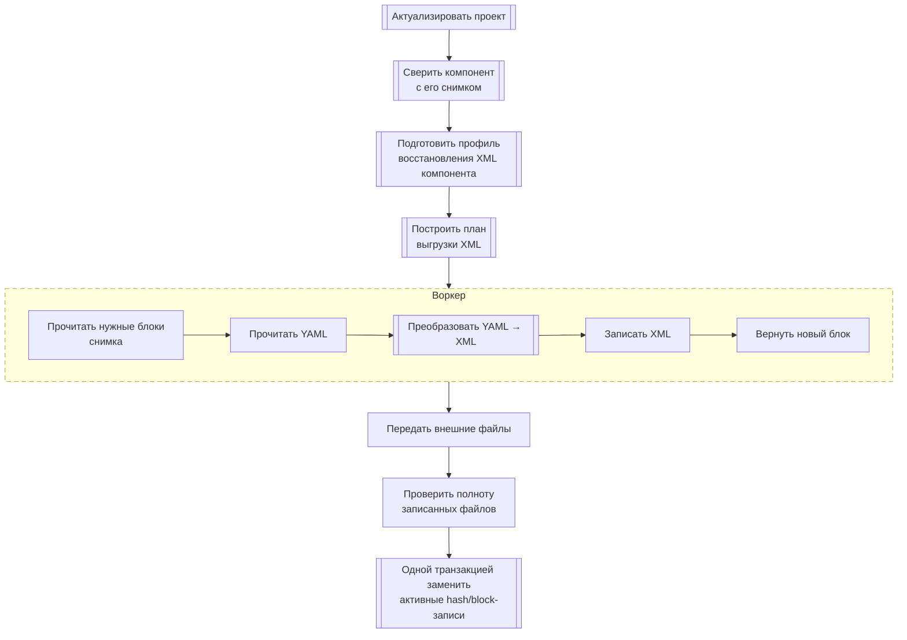

↳ [Актуализировать проект — подробная схема](#subprocess-refresh)

↳ [Подготовить профиль восстановления XML компонента — подробная схема](#subprocess-xml-reconstruction-profile)

### Частичная синхронизация с информационной базой

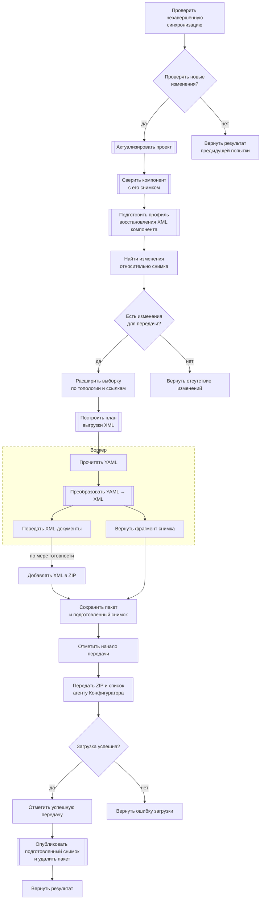

↳ [Актуализировать проект — подробная схема](#subprocess-refresh)

↳ [Подготовить профиль восстановления XML компонента — подробная схема](#subprocess-xml-reconstruction-profile)

### Переименование

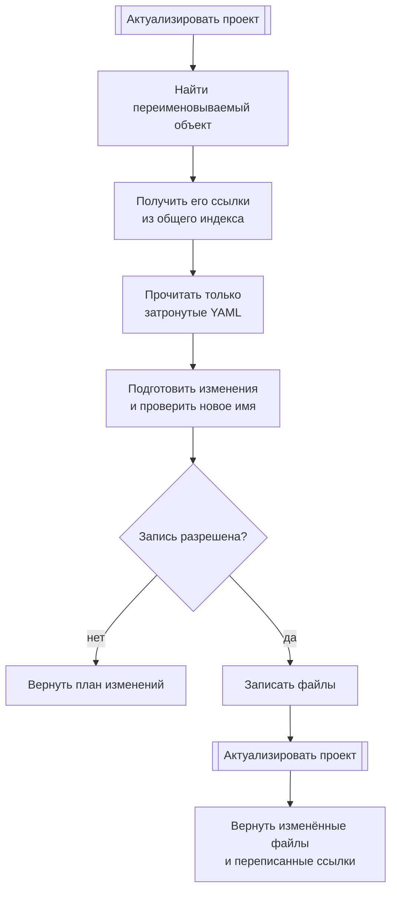

↳ [Актуализировать проект — подробная схема](#subprocess-refresh)

### Поиск ссылок

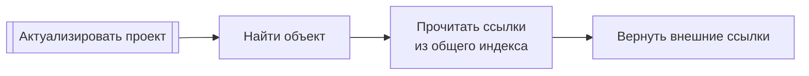

↳ [Актуализировать проект — подробная схема](#subprocess-refresh)
