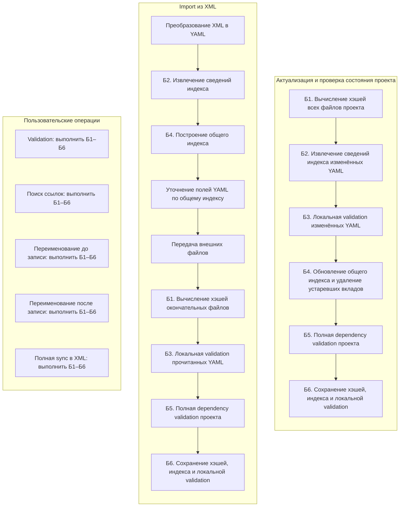

# Архитектура

## Оглавление

- [Правила документа](#правила-документа)
- [Границы metadata-слоёв](#границы-metadata-слоёв)
- [Термины](#термины)
- [Состояние проекта](#состояние-проекта)
- [Транспортные YAML-теги](#транспортные-yaml-теги)
- [Операции](#операции)
  - [Получение списка баз](#получение-списка-баз)
  - [Получение списка расширений информационной базы](#получение-списка-расширений-информационной-базы)
  - [Импорт из информационной базы](#импорт-из-информационной-базы)
  - [Закрытие соединения платформы](#закрытие-соединения-платформы)
  - [Закрытие всех соединений платформы](#закрытие-всех-соединений-платформы)
  - [Импорт из XML](#импорт-из-xml)
  - [Импорт расширения из XML](#импорт-расширения-из-xml)
  - [Полная синхронизация конфигурации в XML](#полная-синхронизация-конфигурации-в-xml)
  - [Полная синхронизация расширения в XML](#полная-синхронизация-расширения-в-xml)
  - [Валидация](#валидация)
  - [Подсказка схем](#подсказка-схем)
  - [Переименование](#переименование)
  - [Поиск ссылок](#поиск-ссылок)
  - [Сброс состояния проекта](#сброс-состояния-проекта)
  - [Перестроение состояния проекта](#перестроение-состояния-проекта)
- [Общие действия](#общие-действия)
- [Проверки реализации](#проверки-реализации)
- [Артефакты](#артефакты)

## Правила документа

- Каждая операция описывается отдельной главой и одной таблицей действий.
- Строки таблицы перечисляются в порядке выполнения.
- Одна строка описывает одно законченное действие с определёнными входами и выходами.
- Маркер `-` перед названием означает вложенное действие, которое повторяется для каждого отдельного файла или задания. Вложенные действия одной группы относятся к тому же объекту и завершаются до перехода к следующему; действия одного физического прохода всё равно показываются отдельными строками.
- Флажок `Воркер` означает, что действие выполняется worker.
- `Частичный` артефакт содержит полный результат назначенной части работы, но не всей операции; `Общий` артефакт получается после объединения всех частичных результатов.
- В главу «Общие действия» выносится только действие, используемое минимум в двух операциях.
- Наименование общего действия является ссылкой на его единый договор в главе [Общие действия](#общие-действия).
- Названия входящих и исходящих артефактов совпадают во всех таблицах и с главой [Артефакты](#артефакты).

## Границы metadata-слоёв

- Общие metadata-слои работают через нейтральные договоры, правила и регистрации property/item-типов; общий механизм проектируется как расширяемый договор, а не как знание о конкретном объекте.
- Переиспользуемые типы и правила объектов могут жить вне applied-слоя и реализовываться через `rules.ts` или зарегистрированный код, но не должны протаскивать знания о конкретных rules-объектах в общие слои.
- Правила конкретных объектов описывают связи YAML/XML, структуру проекта, маршруты синхронизации и внешние обработчики декларативно через `rules.ts`, регистрацию property/item-типов и нейтральные договоры.
- Код, уточняющий `rules.ts` (`fromXML`/`toXML`/`fromYAML`/`toYAML`, особые значения по умолчанию, ветвления по владельцу или `itemType`), находится рядом с конкретным объектом и считается переходным; при изменениях поведение предпочтительно переносится в декларативные правила и регистрации.

## Термины

| Термин | Значение |
|---|---|
| Проект | NKDK-проект в YAML-представлении, включая связанные внешние файлы. |
| Конфигурация | Конфигурация внутри информационной базы «1С:Предприятие». |
| Сеанс платформы | Управляемый SSH-сеанс агента Конфигуратора либо подготовленная конфигурация `ibcmd` для файловой или клиент-серверной базы; агентный сеанс включает подтверждённое владение запущенным NKDK процессом. |
| Универсальный worker метаданных | Одна сохраняемая до завершения MCP worker-линия, выполняющая отдельные обработчики import, validation, полной sync, переименования и поиска ссылок. Между операциями хранит кэши схем и правил и ссылки только для чтения на актуальные общие буферы; временное состояние операции очищает. |
| Проход | Выполнение одного действия для каждого элемента входного списка. Между элементами worker не сохраняет разобранный YAML или XML текущего элемента, если исходящий артефакт явно не требует этого. |
| Топология ресурсов метаданных | Единое неизменяемое описание содержательных файлов Проекта, XML-документов, внешних и игнорируемых файлов. Компилируется из `rules.ts`, project spec и регистраций property-типов; операции используют только её нейтральные проекции и не знают конкретных item/property-типов. |
| Снимок конфигурации | Компонентный двоичный файл версии 1.3, содержащий только хэши записанных файлов и содержательные `entity`: идентификаторы, `omittedChildren` и невосстановимое XML-представление. Validation-, dependency- и полный address-индексы в снимок не входят; они принадлежат отдельно актуализируемому состоянию проекта. |
| Состояние проекта | Восстанавливаемые хэши, локальная validation и общие индексы всего YAML-проекта. Во время работы находятся в нескольких неизменяемых `SharedArrayBuffer`, а на диске — в едином двоичном файле `.nkdk/cache/project-state.bin` формата `0.5.0`. Не заменяет компонентные снимки конфигурации. |

## Состояние проекта

Validation, поиск ссылок и полная sync всегда начинают с одной внутренней операции актуализации. Переименование выполняет её до чтения индекса и повторяет после записи файлов. Публичная validation относится ко всему проекту и не принимает ключ файла или компонента.

Координатор только обнаруживает и классифицирует пути, затем через `ProjectStateStore` одним пакетным запросом получает сохранённые хэши. Пути и соответствующие исходные хэши передаются ограниченными пачками в универсальные worker метаданных. Каждый worker последовательно читает один файл, вычисляет его хэш и сразу освобождает байты неизменённого файла. Изменённый YAML разбирается и проверяется из тех же уже прочитанных байтов; worker читает опубликованные общие буферы, но не изменяет их. Для внешних ресурсов допускается более крупная ограниченная пачка, потому что она содержит только пути и хэши. Пул создаётся лениво, сохраняет прогретые схемы и правила между операциями и закрывается только при завершении MCP.

Этапы Б2 и Б3 выполняются за один разбор каждого изменённого YAML: worker добавляет нормализованные сведения индекса, локальные diagnostics и отложенные проверки в двоичный результат текущей ограниченной пачки. Разделение на этапы фиксирует разные результаты этого прохода, а не дополнительное чтение файла. Worker передают владеющие `ArrayBuffer` по мере готовности; очередь главного процесса принимает результаты вне порядка завершения, ограничивает число ещё не применённых пачек и не восстанавливает промежуточные предметные объекты. Следующее задание не обязано ждать применения предыдущего результата этой линии.

| Этап | Единый договор |
|---|---|
| Б1. Вычисление хэшей всех файлов проекта | Координатор выдаёт найденные пути ограниченными пачками, сразу получает для них исходные хэши через абстракцию состояния и передаёт свободному worker. Worker читает и хэширует все управляемые топологией YAML и внешние файлы; сравнением с исходными хэшами определяет новые и изменённые файлы, а отсутствующие при чтении пути помечает удалёнными. Полный список путей в памяти не собирается. |
| Б2. Извлечение сведений индекса изменённых YAML | Во время единственного разбора новых и изменённых YAML извлекает нормализованные сведения общего индекса и отложенные проверки. Неизменённые YAML повторно не разбирает. |
| Б3. Локальная validation изменённых YAML | Для тех же новых и изменённых YAML выполняет синтаксические, JSON Schema и локальные проверки; результаты неизменённых файлов читает из состояния. |
| Б4. Обновление общего индекса и удаление устаревших вкладов | Заменяет вклады изменённых файлов. Каждый успешно прочитанный и хэшированный файл, классифицированный топологией, добавляет принадлежащие ему цели форм, макетов и других файловых элементов; цель хранит пути всего элемента и содержательного YAML-владельца. Удаление файла каскадно удаляет его хэш, локальные результаты и индексные строки, а цель исчезает только с последним подтверждающим файлом. |
| Б5. Полная dependency validation проекта | Всегда проверяет межфайловые зависимости всего проекта по актуальному общему индексу с компонентной видимостью. `pendingReferences` разрешаются одинаково по целям YAML и хэшированных файлов. Итоговые dependency diagnostics не кэширует. |
| Б6. Сохранение хэшей, индекса и локальной validation | Главный процесс собирает и атомарно публикует согласованный набор общих буферов, затем последовательно и асинхронно сохраняет его в `.nkdk/cache/project-state.bin`; техническая ошибка построения сохраняет прежний снимок. |

Актуализация строит снимок по фактически прочитанным байтам. Каждый ресурс читается и хэшируется один раз; дополнительные `stat`/`fstat`, поля `dev`, `inode`, размер и `mtime` не используются. Параллельное редактирование может сделать результат validation или поиска ссылок сразу устаревшим, но не запускает повтор всего прохода: следующая операция прочитает все ресурсы заново и обнаружит изменение по хэшу. Изменяющие операции проверяют содержимое непосредственно перед использованием: полная sync — по байтам, из которых создаётся XML или копируется внешний файл, переименование — по ожидаемым хэшам всех затронутых YAML перед началом применения плана.

Общая логика зависит от `ProjectStateStore` и типизированных пакетных запросов `ProjectStateReadSession`, а не от физического формата. Двоичный адаптер использует представления structurae для записей и собственные хэш-индексы с линейным пробированием и заполнением не выше 80%; совпадение хэша всегда подтверждается сравнением исходного ключа. Полной копии состояния в JSON или `Map` нет.

Главный процесс — единственный владелец изменений: он принимает от worker двоичные вклады без JSON-преобразования, строит новый набор `SharedArrayBuffer` и целиком заменяет опубликованный снимок. Worker получают общие буферы только для чтения и возвращают новые вклады с передачей владения обычными `ArrayBuffer`. После загрузки, публикации или сброса состояния главный процесс заменяет либо очищает сохранённые ссылки во всех существующих worker; новая worker-линия получает последние буферы до первого задания. Прежние файлы во время потокового обхода отмечаются битовой картой по числовым идентификаторам; после обхода неотмеченные вклады удаляются. Если хэши не изменились и удалений нет, новый снимок не строится и сохранение на диск не планируется. Сохранения выполняются асинхронно и строго последовательно; следующее изменение ждёт окончания предыдущего сохранения, поэтому два быстро запущенных прохода не могут перезаписать результат друг друга.

Diagnostics имеют два срока жизни. Локальные diagnostics принадлежат версии YAML и сохраняются в состоянии проекта; dependency diagnostics и другие результаты текущей операции хранятся только в двоичной коллекции до подготовки ответа. MCP однократно обходит эту коллекцию, показывает не более 100 записей и не более 512 КиБ их JSON-представления, затем освобождает временные буферы. Если полный результат не помещается, он записывается крупными последовательными блоками в `.nkdk/reports/<operation>-<operationId>.jsonl`: временный файл атомарно переименовывается, и лишь после этого удаляется предыдущий отчёт той же операции. Краткий ответ содержит `summary`, `diagnostics`, `truncated` и ссылку `report`; текст ответа содержит только сводку и не повторяет `structuredContent`. Большие списки ссылок проходят через тот же отчёт с видом записи `reference`.

Один MCP-процесс лениво создаёт один `ProjectStateService` и один универсальный пул worker метаданных; при переключении `projectDir` ранее активное состояние закрывается, а двоичный снимок нового проекта загружается в общие буферы и устанавливается в worker. Пул лениво увеличивается до наибольшей запрошенной параллельности и не уничтожает лишние прогретые линии при последующем уменьшении. Единственный признак совместимости состояния — версия формата `0.5.0`; отдельного отпечатка схем и правил нет.

Наличие файловой цели определяется только хэшированным вкладом в `ProjectState`. Validation, import, полная sync, поиск ссылок и переименование используют одну проекцию топологии и запросы общего индекса; прямые `existsSync`, `readdirSync` и аналогичные проверки существования цели вне `ProjectState` запрещены.

`reset` закрывает текущее состояние выбранного проекта в памяти и удаляет только его восстанавливаемый дисковый снимок. `rebuild` строит полное состояние в отдельной базе и заменяет активное состояние и дисковый снимок только после успешной технической фиксации; обычные diagnostics являются результатом validation и не отменяют перестроение.

## Транспортные YAML-теги

Локальный тег `!xml` передаёт одно из двух явно зарегистрированных действий над формой XML: сохранить присутствие XML-значения, совпадающего с неявным YAML-default, либо сохранить отсутствие XML-тега, для которого правило иначе создаёт XML-default. Во втором случае транспортным значением служит пустой scalar. Parser возвращает обычный scalar и хранит транспортную пометку отдельно от предметной модели; поэтому JSON Schema, semantic validation и правила типа видят обычное значение без нового варианта схемы.

Metadata ruleRuntime принимает тег только для явно зарегистрированной пары `itemType + propertyKey + value`. Незарегистрированное применение является ошибкой импорта. Регистрация исключительна: каждое новое применение `!xml` предварительно согласовывается с разработчиком и располагается рядом с правилами конкретного свойства.

Локальный type-handler конкретного metadata-типа может по отдельно согласованному договору хранить scalar tag у вложенного смыслового поля. Такой обработчик проверяет допустимое поле и значение самостоятельно, переносит пометку вне предметной модели и не расширяет JSON Schema служебным признаком.

Явно зарегистрированное XML-only свойство может использовать пустой scalar с `!xml` как чисто транспортное действие без смыслового значения. Такое поле создаётся и потребляется только XML ↔ YAML импортом/экспортом, исключается из JSON Schema и полностью игнорируется semantic validation; допустимость `itemType + propertyKey + действие` проверяет транспортный реестр до преобразования XML.

## Операции

### Получение списка баз
| Действие | Описание | Входящие артефакты | Исходящие артефакты | Воркер |
|---|---|---|---|:---:|
| Определение источников списка баз | По окружению текущей ОС находит личный `ibases.v8i`, локальные `1cestart.cfg`, подключённые через `CommonCfgLocation` общие конфигурации и объявленные в них `CommonInfoBases`. Канонически совпадающий `.cfg` или `.v8i` учитывает один раз; порядок начинает личный список и затем сохраняет порядок конфигураций и параметров. | [Окружение платформы](#artifact-okruzhenie-platformy) | [Упорядоченный список источников баз](#artifact-uporyadochennyi-spisok-istochnikov-baz), [Диагностики получения списка баз](#artifact-diagnostiki-polucheniya-spiska-baz) |  |
| Обработка одного источника баз | Последовательно выполняет вложенные действия для каждого доступного `.v8i`. | [Упорядоченный список источников баз](#artifact-uporyadochennyi-spisok-istochnikov-baz) | [Частичные записи списка баз](#artifact-chastichnye-zapisi-spiska-baz), [Прочитанные источники баз](#artifact-prochitannye-istochniki-baz), [Диагностики получения списка баз](#artifact-diagnostiki-polucheniya-spiska-baz) |  |
| - Чтение списка баз | Читает один `.v8i` как UTF-8 с допустимым BOM. Ошибка чтения сохраняется как диагностика и не останавливает обработку следующих источников. | [Упорядоченный список источников баз](#artifact-uporyadochennyi-spisok-istochnikov-baz) | [Текст списка баз](#artifact-tekst-spiska-baz), [Прочитанные источники баз](#artifact-prochitannye-istochniki-baz), [Диагностики получения списка баз](#artifact-diagnostiki-polucheniya-spiska-baz) |  |
| - Разбор списка баз | Преобразует разделы `.v8i` в записи папок и баз, разбирает `Connect` в типизированное файловое, серверное, веб- или неизвестное подключение и сохраняет исходный `Connect`. Некорректный раздел пропускает с диагностикой. | [Текст списка баз](#artifact-tekst-spiska-baz) | [Частичные записи списка баз](#artifact-chastichnye-zapisi-spiska-baz), [Диагностики получения списка баз](#artifact-diagnostiki-polucheniya-spiska-baz) |  |
| Объединение записей списка баз | Объединяет папки по полному пути. Между разными источниками удаляет повторные базы по `ID` или нормализованному `Connect`, сохраняя первую; одинаковые подключения внутри одного `.v8i` сохраняет. | [Частичные записи списка баз](#artifact-chastichnye-zapisi-spiska-baz) | [Объединённые записи списка баз](#artifact-obedinennye-zapisi-spiska-baz) |  |
| Построение дерева баз | Восстанавливает вложенность по `Folder`, сохраняет явные пустые папки, создаёт отсутствующие промежуточные папки с диагностикой и сортирует соседей по `OrderInTree`, затем по порядку появления. | [Объединённые записи списка баз](#artifact-obedinennye-zapisi-spiska-baz) | [Дерево информационных баз](#artifact-derevo-informatsionnyh-baz), [Диагностики получения списка баз](#artifact-diagnostiki-polucheniya-spiska-baz) |  |
| Формирование результата получения списка баз | Объединяет дерево, успешно прочитанные источники и структурированные диагностики. Даже при отсутствии доступных источников возвращает успешный пустой результат с диагностикой. | [Дерево информационных баз](#artifact-derevo-informatsionnyh-baz), [Прочитанные источники баз](#artifact-prochitannye-istochniki-baz), [Диагностики получения списка баз](#artifact-diagnostiki-polucheniya-spiska-baz) | [Результат получения списка баз](#artifact-rezultat-polucheniya-spiska-baz) |  |

### Получение списка расширений информационной базы

Публичный MCP-инструмент: `nkdk.list_infobase_extensions`.

| Действие | Описание | Входящие артефакты | Исходящие артефакты | Воркер |
|---|---|---|---|:---:|
| Чтение настроек подключения проекта | По корню Проекта читает `.nkdk/project.yaml`; параметры подключения не принимаются публичным инструментом и не возвращаются в результате. | [Параметры получения списка расширений](#artifact-parametry-polucheniya-spiska-rasshirenii) | [Настройки проекта](#artifact-nastroiki-proekta) |  |
| Поиск установки платформы | Выбирает самую новую установленную сборку `8.3.27.*` и проверяет приложение выбранного настройками режима: `1cv8` для агента либо `ibcmd` для offline-режима. | [Окружение платформы](#artifact-okruzhenie-platformy), [Настройки проекта](#artifact-nastroiki-proekta) | [Установка платформы](#artifact-ustanovka-platformy) |  |
| Получение сеанса платформы | Последовательно для одного Проекта переиспользует совместимый активный сеанс либо создаёт его по тем же правилам, что импорт из информационной базы. После операции начинает заново отсчёт `sessionIdleTimeout`; после отмены или `session_timeout` останавливает и удаляет сеанс, чтобы поздний ответ не попал в следующую операцию. | [Настройки проекта](#artifact-nastroiki-proekta), [Установка платформы](#artifact-ustanovka-platformy), [Корень проекта](#artifact-koren-proekta) | [Сеанс платформы](#artifact-soedinenie-platformy) |  |
| Чтение и нормализация свойств расширений | Одной командой с 30-минутным ограничением времени получает свойства всех расширений: `config extensions properties get --all-extensions` через агент либо `ibcmd infobase config extension list` в offline-режиме. Строго нормализует полный ответ, сохраняет порядок платформы и возвращает пустой список как успех; при ошибке частичный список не возвращает. | [Сеанс платформы](#artifact-soedinenie-platformy) | [Сырые свойства расширений](#artifact-syrye-svoistva-rasshirenii), [Список расширений информационной базы](#artifact-spisok-rasshirenii-informatsionnoi-bazy), [Результат получения списка расширений](#artifact-rezultat-polucheniya-spiska-rasshirenii) |  |

### Импорт из информационной базы

Публичный MCP-инструмент: `nkdk.import_from_infobase`.

| Действие | Описание | Входящие артефакты | Исходящие артефакты | Воркер |
|---|---|---|---|:---:|
| Проверка запроса импорта из базы | Требует явного разрешения записи, строку подключения `File` либо `Srvr`/`Ref` и отсутствующий либо пустой `cf`. Оба режима поддерживают оба вида подключения; для offline `Srvr`/`Ref` дополнительно обязательны параметры СУБД, а для `File` они запрещены. | [Параметры импорта из информационной базы](#artifact-parametry-importa-iz-informatsionnoi-bazy), [Корень проекта](#artifact-koren-proekta) | [Подтверждённый корень проекта](#artifact-podtverzhdennyi-koren-proekta) |  |
| Поиск установки платформы | Выбирает самую новую установленную сборку `8.3.27.*` и проверяет приложение выбранного режима: `1cv8` для агента либо `ibcmd` для offline-режима. | [Окружение платформы](#artifact-okruzhenie-platformy), [Параметры импорта из информационной базы](#artifact-parametry-importa-iz-informatsionnoi-bazy) | [Установка платформы](#artifact-ustanovka-platformy) |  |
| Подготовка временной выгрузки | Создаёт отдельный каталог операции внутри `.nkdk/tmp/import-from-infobase`. | [Подтверждённый корень проекта](#artifact-podtverzhdennyi-koren-proekta) | [Временная XML-выгрузка информационной базы](#artifact-vremennaya-xml-vygruzka-informatsionnoi-bazy) |  |
| Получение сеанса платформы | Последовательно для одного Проекта переиспользует подходящий сеанс: запускает агент Конфигуратора с `AgentBaseDir` в `.nkdk`, отдельным ключом хоста и SSH с проверкой SHA-256 ключа, затем проверяет служебный каталог пользователя по `agentbasedir.json`; либо готовит `config.yaml` через `ibcmd server config init`. Для offline `File` передаёт путь базы, для offline `Srvr`/`Ref` — отдельные параметры СУБД. После операции начинает заново отсчёт `sessionIdleTimeout`. | [Параметры импорта из информационной базы](#artifact-parametry-importa-iz-informatsionnoi-bazy), [Установка платформы](#artifact-ustanovka-platformy), [Корень проекта](#artifact-koren-proekta) | [Сеанс платформы](#artifact-soedinenie-platformy) |  |
| Выгрузка конфигурации из базы | Агент для `File` и `Srvr`/`Ref` через SSH выполняет `config dump-config-to-files` без необязательного `--server` во внутренний staging-каталог служебного пользователя, затем переименовывает его в каталог операции; частичная выгрузка также переносится. Offline-режим для обоих видов подключения запускает с ограничением времени `ibcmd infobase config export` с подготовленным `config.yaml`. Оба пути создают иерархическую XML-выгрузку. | [Сеанс платформы](#artifact-soedinenie-platformy), [Временная XML-выгрузка информационной базы](#artifact-vremennaya-xml-vygruzka-informatsionnoi-bazy) | [Корень XML-выгрузки](#artifact-koren-xml-vygruzki) |  |
| Импорт временной XML-выгрузки | Выполняет обычный импорт XML → YAML напрямую в новый `cf`, но переносит связанные внешние файлы вместо копирования. | [Корень XML-выгрузки](#artifact-koren-xml-vygruzki), [Подтверждённый корень проекта](#artifact-podtverzhdennyi-koren-proekta) | [Список файлов результата импорта](#artifact-spisok-failov-rezultata-importa), [Снимок конфигурации](#artifact-snimok-konfiguratsii) |  |
| Запись настроек проекта | Только после полного успеха записывает строку подключения, учётные данные информационной базы, режим, `sessionIdleTimeout` и при наличии параметры СУБД в `.nkdk/project.yaml`; пароли не попадают в диагностику. | [Параметры импорта из информационной базы](#artifact-parametry-importa-iz-informatsionnoi-bazy), [Список файлов результата импорта](#artifact-spisok-failov-rezultata-importa) | [Настройки проекта](#artifact-nastroiki-proekta) |  |
| Формирование результата импорта из базы | При успехе удаляет временную XML-выгрузку. При ошибке сохраняет её доступную часть и возвращает путь вместе с диагностикой. | [Временная XML-выгрузка информационной базы](#artifact-vremennaya-xml-vygruzka-informatsionnoi-bazy), [Настройки проекта](#artifact-nastroiki-proekta), [Снимок конфигурации](#artifact-snimok-konfiguratsii) | [Результат импорта из информационной базы](#artifact-rezultat-importa-iz-informatsionnoi-bazy) |  |

### Закрытие соединения платформы

Публичный MCP-инструмент: `nkdk.close_platform_connection`.

| Действие | Описание | Входящие артефакты | Исходящие артефакты | Воркер |
|---|---|---|---|:---:|
| Закрытие соединения проекта | По каноническому корню Проекта закрывает SSH-сеанс и останавливает только процесс с подтверждённым владением NKDK. Отсутствие активного соединения является успешным результатом с `closed: false`. | [Корень проекта](#artifact-koren-proekta), [Соединение платформы](#artifact-soedinenie-platformy) | [Результат закрытия соединения платформы](#artifact-rezultat-zakrytiya-soedineniya-platformy) |  |

### Закрытие всех соединений платформы

Публичный MCP-инструмент: `nkdk.close_all_platform_connections`.

| Действие | Описание | Входящие артефакты | Исходящие артефакты | Воркер |
|---|---|---|---|:---:|
| Закрытие соединений MCP-процесса | Закрывает все соединения текущего MCP-процесса, продолжая обработку после ошибки отдельного соединения, и подсчитывает закрытые соединения и остановленные принадлежащие NKDK процессы. | [Соединения платформы](#artifact-soedineniya-platformy) | [Результат закрытия всех соединений платформы](#artifact-rezultat-zakrytiya-vseh-soedinenii-platformy) |  |

### Импорт из XML

Import принимает готовую XML-выгрузку одного компонента. Целевой каталог компонента должен отсутствовать либо быть пустым. Для расширения перед началом import выполняется [актуализация и проверка состояния проекта](#состояние-проекта), чтобы первый проход видел актуальные сведения основной конфигурации.

| Действие | Описание | Воркер |
|---|---|:---:|
| Определение компонента и проверка цели | Читает корневой `Configuration.xml`, определяет адрес `cf` либо `cfe/<Имя>` и проверяет пустую цель. |  |
| Открытие import session | Начинает отдельное транзакционное состояние и удаляет из него прежние вклады целевого компонента. Опубликованное состояние до завершения import не меняется. |  |
| Первый проход import | Ограниченными пачками читает XML и для каждого задания формирует YAML, сведения основного индекса, локальные diagnostics и данные компонентного снимка конфигурации. Локальная validation использует тот же общий модуль и смысловые данные окончательного YAML, сформированные YAML-сериализатором. | ✓ |
| Ранняя запись готового YAML | Если YAML не содержит отложенных значений, worker сериализует его в окончательный текст и согласованные смысловые данные, записывает текст в первом проходе, вычисляет хэш по записываемым байтам и передаёт смысловые данные в общий модуль локальной validation без повторного чтения или разбора текста. Результат добавляется в накопленный двоичный фрагмент, после чего YAML освобождается. До второго прохода остаются только YAML с отложенными значениями. | ✓ |
| Фиксация основного индекса первого прохода | После приёма всех двоичных вкладов строит временный неизменяемый снимок основного индекса. Он нужен только второму проходу и отдельно на диск не сохраняется. |  |
| Второй проход только для чтения | Каждый worker использует установленные ссылки на неизменяемый рабочий индекс, уточняет принадлежащие ему отложенные значения, формирует ту же согласованную пару окончательного текста и смысловых данных, записывает и проверяет оставшиеся YAML, добавляет окончательные сведения в новый двоичный накопитель и освобождает объекты. | ✓ |
| Передача внешних файлов | После второго прохода отдельным этапом копирует либо перемещает связанные внешние файлы. Затем вычисляет их хэши, классифицирует общей топологией и добавляет окончательные файловые цели в состояние. Ошибка передачи или хэширования не публикует import session. |  |
| Б5. Полная dependency validation проекта | Выполняет ту же полную проверку зависимостей по окончательным YAML- и файловым целям, что и обычная актуализация. |  |
| Б6. Сохранение хэшей, индекса и локальной validation | Атомарно записывает компонентный снимок конфигурации, публикует окончательные общие буферы и последовательно сохраняет их в `.nkdk/cache/project-state.bin`. При технической ошибке незавершённое состояние отбрасывается. |  |

Diagnostics итоговой проверки возвращаются результатом import. Ошибки validation не отменяют уже успешно сформированный YAML, но техническая ошибка не публикует незавершённое состояние проекта.

Главный процесс не получает дублирующие предметные `ownerFacts`, `validationContribution` или разобранные YAML и не удерживает список результатов всех import-заданий: те же сведения приходят двоичными пачками и сразу применяются к состоянию import session. Профиль содержит только агрегаты worker-линий и отдельные времена первого прохода, рабочего индекса, второго прохода, двоичного кодирования и приёма, внешних файлов, окончательной сборки, dependency validation, публикации, сохранения, подготовки краткого ответа и записи полного отчёта.

### Импорт расширения из XML

| Действие | Описание | Воркер |
|---|---|:---:|
| Выполнение import зависимого компонента | Использует тот же import, раннюю запись и read-only второй проход. Имя и `componentPath` расширения определяются из корневого XML, а перед открытием import session выполняются этапы Б1–Б6 для существующего проекта. Благодаря этому сведения `cf`, необходимые зависимому компоненту, читаются из актуального общего индекса; общие metadata-слои не получают частных условий по `cfe`, `ObjectBelonging`, `ExtendedConfigurationObject` или `BaseForm`. | ✓ |

### Полная синхронизация конфигурации в XML

| Действие | Описание | Воркер |
|---|---|:---:|
| Б1. Вычисление хэшей всех файлов проекта | Начинает обязательную актуализацию всего проекта. |  |
| Б2. Извлечение сведений индекса изменённых YAML | Обновляет сведения только новых и изменённых YAML. | ✓ |
| Б3. Локальная validation изменённых YAML | Проверяет локально только новые и изменённые YAML, сохраняя результаты неизменённых файлов. | ✓ |
| Б4. Обновление общего индекса и удаление устаревших вкладов | Заменяет изменённые вклады и удаляет устаревшие вклады исчезнувших файлов. |  |
| Б5. Полная dependency validation проекта | Проверяет зависимости всего проекта независимо от числа изменённых файлов. |  |
| Б6. Сохранение хэшей, индекса и локальной validation | Публикует актуальное состояние проекта до чтения данных для sync. |  |
| Проверка допуска | По умолчанию error-diagnostics прекращают sync. `ignoreValidationErrors: true` разрешает продолжить, но не пропускает Б1–Б6 и сохраняет diagnostics в результате. Техническая ошибка блокирует операцию всегда. |  |
| Подтверждение состояния компонента | Читает проекцию выбранного компонента из состояния проекта и компонентный снимок конфигурации, проверяет полный состав файлов и хэши. |  |
| Формирование полного XML | Использует сохранённые worker ссылки только для чтения на актуальный общий индекс. Каждый YAML повторно хэшируется по тем же байтам, из которых формируется XML, а внешний файл — во время переноса; расхождение с ожидаемым хэшем прекращает операцию. Результат записывается в отсутствующий либо пустой `xmlDir`. | ✓ |
| Публикация снимка конфигурации | Проверяет записанные файлы и атомарно заменяет компонентный снимок конфигурации. |  |

Операция формирует полный XML выбранного компонента. Частичная синхронизация изменившихся файлов сейчас не реализована. Подключение к 1С и загрузка результата в Конфигурацию в эту операцию не входят.

### Полная синхронизация расширения в XML

| Действие | Описание | Воркер |
|---|---|:---:|
| Формирование полного XML расширения | Использует те же этапы Б1–Б6 и тот же полный XML-export выбранного компонента. Профиль расширения дополнительно читает подтверждённое состояние `cf`, применяет компонентную видимость общего индекса и восстанавливает зарегистрированные сведения заимствования и `BaseForm`. Соседние `cfe` в индексном представлении расширения не видны. | ✓ |

### Валидация

Публичный MCP-инструмент: `nkdk.validate_project`.

Validation принимает только `projectDir`: ключа отдельного файла или компонента в её договоре нет. Она всегда выполняет этапы Б1–Б6 для всего проекта и возвращает полный набор diagnostics по прочитанным байтам. Даже при неизменном проекте хэшируются все управляемые файлы и выполняется полная dependency validation; повторный парсинг YAML при этом не требуется. Параллельное редактирование может сразу сделать результат устаревшим; следующая validation обнаруживает новую версию по хэшу.

| Действие | Описание |
|---|---|
| Актуализация и проверка | Выполняет Б1–Б6 для всего проекта и возвращает полный набор актуальных diagnostics. |

### Подсказка схем

| Действие | Описание | Входящие артефакты | Исходящие артефакты | Воркер |
|---|---|---|---|:---:|
| [Подготовка структуры проекта](#общее-действие-подготовка-структуры-проекта) | Подготавливает правила обнаружения и классификации файлов Проекта. | [rules.ts](#artifact-rules-ts) | [Правила структуры проекта](#artifact-pravila-struktury-proekta) |  |
| Классификация целевого пути | Определяет роль и правило запрошенного пути. | [Корень проекта](#artifact-koren-proekta), [Правила структуры проекта](#artifact-pravila-struktury-proekta), [Целевой путь](#artifact-tselevoi-put) | [Классифицированный целевой путь](#artifact-klassifitsirovannyi-tselevoi-put) |  |
| Выбор JSON Schema | Выбирает схему по роли и правилу целевого пути. | [Классифицированный целевой путь](#artifact-klassifitsirovannyi-tselevoi-put) | [JSON Schema](#artifact-json-schema) |  |
| Формирование подсказок | Строит подсказки для запрошенной позиции YAML. | [JSON Schema](#artifact-json-schema), [Целевой путь](#artifact-tselevoi-put) | [Подсказки схемы](#artifact-podskazki-shemy) |  |

### Переименование

Публичный MCP-инструмент: `nkdk.rename_item`.

| Действие | Описание |
|---|---|
| Актуализация до записи | Всегда выполняет Б1–Б6, затем читает целевой объект и обращения к нему из актуального индекса. Error-diagnostics блокируют действие, если `ignoreValidationErrors` не равен `true`. |
| Формирование плана | Проверяет имя и конфликт, перечитывает только затронутые YAML, сохраняет хэш их байтов, сверяет их с индексом и строит изменения значений, путей и migration. При `allowWrite`, отличном от `true`, возвращает план без записи. |
| Проверка и применение | Перед началом записи повторно хэширует все затронутые YAML и не применяет план при расхождении. Затем записывает проверенный план; изменение уже во время многофайлового применения может оставить частичный результат. `ignoreValidationErrors: true` не пропускает проверки и не скрывает diagnostics. |
| Актуализация после записи | После любой попытки применения обязательно повторяет Б1–Б6. Возвращает diagnostics состояния файлов после записи, в том числе при частично применившемся плане. |

### Поиск ссылок

Публичный MCP-инструмент: `nkdk.find_references`.

Операция всегда выполняет Б1–Б6 и ищет обращения в индексе прочитанных байтов без полного повторного обхода YAML. По умолчанию error-diagnostics блокируют поиск. `ignoreValidationErrors: true` разрешает продолжить и возвращает diagnostics вместе с предупреждением, что результат может быть неполным; validation и чтение индекса по-прежнему выполняются. Параллельное редактирование после чтения может сделать результат устаревшим и будет обнаружено следующим вызовом.

| Действие | Описание |
|---|---|
| Актуализация и поиск | Выполняет Б1–Б6, проверяет допуск и запрашивает обращения к целевому логическому адресу в актуальном индексе. |

### Сброс состояния проекта

Публичный MCP-инструмент: `nkdk.reset_project_cache`.

Требует `projectDir` и `allowWrite: true`. Закрывает состояние проекта в памяти и удаляет только `.nkdk/cache/project-state.bin`. Не запускает validation, не изменяет YAML, компонентные снимки конфигурации или файл индекса конфигурации; следующая обычная операция выполнит холодное построение.

| Действие | Описание |
|---|---|
| Сброс | Закрывает состояние в памяти и удаляет только восстанавливаемый дисковый снимок. |

### Перестроение состояния проекта

Публичный MCP-инструмент: `nkdk.rebuild_project_cache`.

Требует `projectDir` и `allowWrite: true`. Строит отдельное полное состояние этапами Б1–Б6 и только после успешной технической фиксации атомарно заменяет активную базу в памяти и дисковый снимок. Обычные diagnostics возвращаются вместе со статистикой и не считаются технической ошибкой.

| Действие | Описание |
|---|---|
| Перестроение | Выполняет Б1–Б6 в отдельном состоянии и атомарно заменяет активное после успешной технической фиксации. |

## Общие действия

| Общее действие | Единый договор | Используется в операциях |
|---|---|---|
| Проверка целевого каталога XML | Не очищает существующий каталог. Полный XML-результат формируется в отсутствующем либо пустом каталоге. | Полная синхронизация в XML |
| Подготовка структуры проекта | Компилирует из `rules.ts`, project spec и регистраций property-типов единую неизменяемую топологию содержательных файлов, XML-документов, внешних и игнорируемых файлов. Общий слой не ветвится по конкретным реализациям метаданных. | Import, sync, validation, подсказка схем |
| Актуализация и проверка состояния проекта | Выполняет этапы Б1–Б6 над единым состоянием всего проекта. Не принимает `ignoreValidationErrors`: решение продолжать после diagnostics принадлежит вызывающей публичной операции. | Validation, полная sync, переименование, поиск ссылок |
| Сеанс чтения состояния проекта | Устанавливает в универсальных worker ссылки на согласованный набор общих буферов и открывает над ними типизированные представления только для чтения. Представления сохраняются между операциями до публикации или сброса состояния и предоставляют пакетные предметные запросы, а не SQL. | Второй проход import, полная sync, переименование, поиск ссылок |
| Проверка согласованности состояния компонента | Сверяет полный набор файлов и хэшей компонента из состояния проекта с компонентным снимком конфигурации. Расхождение прекращает sync. | Полная синхронизация конфигурации и расширения |
| Запись снимка конфигурации | Пишет временный файл, проверяет его и атомарно заменяет итоговый путь. При ошибке прежний опубликованный снимок остаётся неизменным. | Import и полная sync |

## Проверки реализации

- Цель отдельного test case — не более 10 мс, обязательный предел — 50 мс.
- Предел test file вместе с импортом и hooks — 1 000 мс; integration-тесты не являются исключением.
- После изменения обязателен `pnpm check:duplicates -- --base e768ba6321fc99b2623e04f1fe72a06c77f07b38`, затем `pnpm type-check` и полный `pnpm test`.
- Mutation testing для этой реализации отключён по прямому решению пользователя.

## Артефакты

| Артефакт | Описание |
|---|---|
| Окружение платформы | Текущая ОС, архитектура и значения переменных среды, необходимые для определения штатных путей 1С. |
| Параметры импорта из информационной базы | Корень Проекта, строка подключения 1С, необязательные логин и пароль информационной базы, `useStandaloneServer`, положительный `sessionIdleTimeout` в секундах, параметры СУБД для offline `Srvr`/`Ref` и явное разрешение записи. |
| Параметры получения списка расширений | Корень Проекта и необязательный сигнал отмены; не содержит строки подключения, учётных данных и разрешения записи. |
| Установка платформы | Выбранная сборка `8.3.27.*` с каноническим каталогом и независимо найденными путями к `1cv8`, `ibcmd` и `ibsrv`. |
| Сеанс платформы | Живой SSH-сеанс агента либо приватный `config.yaml` для запусков `ibcmd`, удаляемый при закрытии; режим, рабочий каталог и сведения о подтверждённом владении дочерним процессом без пароля в публичных данных. |
| Сеансы платформы | Активные сеансы текущего MCP-процесса, индексированные по каноническому корню Проекта. |
| Сырые свойства расширений | Полный ответ одной команды платформы до нормализации: записи `extension-properties` из `success.body` агента либо текст стандартного вывода `ibcmd`; существует только внутри адаптера и не входит в публичный результат. |
| Список расширений информационной базы | Упорядоченные сведения о каждом расширении: имя, версия, активность, назначение, безопасный режим, профиль безопасности, защита опасных действий, использование в распределённой базе, область и контрольная сумма. |
| Результат получения списка расширений | Публичный список расширений, использованный режим платформы и признак переиспользования сеанса; не содержит настроек подключения, команд, необработанных ответов и секретов. |
| Временная XML-выгрузка информационной базы | Каталог операции `.nkdk/tmp/import-from-infobase/<operation-id>` с иерархической XML-выгрузкой и журналом платформы; удаляется после успеха и сохраняется при ошибке. |
| Настройки проекта | Версионированный `.nkdk/project.yaml` со строкой подключения, учётными данными информационной базы, режимом платформы, временем простоя соединения и необязательными параметрами СУБД. |
| Результат импорта из информационной базы | Статистика и диагностики обычного XML → YAML импорта, путь к снимку и настройкам, использованный режим, признак переиспользования соединения и путь сохранённой временной выгрузки при ошибке. |
| Результат закрытия соединения платформы | Признаки наличия закрытого соединения и остановки подтверждённо принадлежащего NKDK процесса. |
| Результат закрытия всех соединений платформы | Количество закрытых соединений и остановленных подтверждённо принадлежащих NKDK процессов текущего MCP-процесса. |
| Упорядоченный список источников баз | Канонически уникальные пути `.v8i`: сначала личный список, затем общие списки в порядке конфигураций и параметров `CommonInfoBases`. |
| Текст списка баз | Содержимое одного доступного `.v8i` в UTF-8 после удаления необязательного BOM. |
| Частичные записи списка баз | Разобранные папки и базы одного источника с исходным порядком, путём источника и полями, необходимыми для объединения. |
| Объединённые записи списка баз | Записи всех доступных источников после объединения папок и удаления повторных баз между источниками. |
| Прочитанные источники баз | Успешно прочитанные `.v8i` в фактическом порядке обработки. |
| Дерево информационных баз | Упорядоченное дерево явных и неявных папок и баз с типизированными подключениями и путями источников. |
| Диагностики получения списка баз | Структурированные коды, пути источников и сообщения о недоступных файлах, некорректных конфигурациях, разделах и неявных папках. |
| Результат получения списка баз | Публичный результат `tree`, `sources`, `warnings`, который `@nkdk/mcp` возвращает без предметных преобразований. |
| Корень проекта | Каталог NKDK-проекта, относительно которого выполняется операция. |
| Контекст зависимого компонента | Нейтральное описание выбранного компонента, его базового компонента, целевого пути снимка и порядка разрешения ссылок. Снимок базового компонента не содержит и не читает. Не содержит знаний о конкретных именах каталогов и XML-полях. |
| Корень базового компонента | Каталог YAML-компонента, указанного как базовый в контексте зависимого компонента. |
| Подтверждённый корень проекта | Проверенный отсутствующий либо пустой каталог, в который разрешён импорт. |
| Подтверждённый целевой компонент | Проверенные целевые пути зависимого компонента и его снимка, в которых нет конфликтующих данных. |
| Правила структуры проекта | Подготовленные из `rules.ts` правила обнаружения, классификации и размещения YAML и внешних файлов. |
| Список путей проекта | Найденные пути файлов и каталогов Проекта без назначенных ролей и без содержимого файлов. |
| Структура проекта | Пути, роли, владельцы и правила найденных YAML и внешних файлов без их содержимого. В будущем может поддерживаться в памяти и обновляться по событиям файловой системы. |
| Структура базового компонента | Классифицированные пути, роли, владельцы и правила только базового YAML-компонента. |
| Подтверждённое состояние компонента | Согласованный набор структуры, полных текущих хэшей, индекса метаданных и индекса зависимостей одного компонента. |
| Подтверждённое состояние базового компонента | Согласованный набор структуры, полных текущих хэшей и индексов `cf`, дополнительно совпавший со снимком основной конфигурации. |
| Список заданий чтения проекта | Полный список YAML-файлов, которые требуется последовательно прочитать в текущей операции. |
| Частичный список заданий чтения проекта | YAML-файлы, назначенные одному worker для последовательной обработки. |
| YAML-текст | Байты или текст одного прочитанного YAML-файла. Существует только во время обработки этого файла. |
| YAML-данные | Структурированные данные одного разобранного YAML-файла. Одновременно worker удерживает не более одного такого результата, если операция явно не строит metadata-модель. |
| Частичный индекс метаданных | Компактные типизированные факты и индексы полей, собранные из назначенных файлов. |
| Частичный индекс зависимостей | Компактные ссылки, `ПутьКДанным`, пути правил и координаты источников, собранные из назначенных файлов. |
| Общий индекс метаданных | Объединённые типизированные факты и индексы полей всех метаданных Проекта с привязкой к полному набору исходных хэшей. |
| Общий индекс зависимостей | Объединённый индекс зависимостей с обратным отображением от владельца фактов к зависящим YAML-файлам и привязкой к полному набору исходных хэшей. |
| Общий индекс конфигурации | Объединённые metadata-факты только базового компонента `cf`, собранные тем же механизмом, что и при валидации. Не содержит данных расширений. |
| Общий индекс зависимостей конфигурации | Объединённые зависимости только базового компонента `cf`. Не содержит данных расширений. |
| Корень XML-выгрузки | Каталог исходной XML-выгрузки Конфигурации. |
| Корневое описание XML-компонента | Минимально разобранный корневой `Configuration.xml`, достаточный для выбора зарегистрированного вида компонента и его имени. |
| Правила структуры XML-выгрузки | XML-проекция единой топологии ресурсов: XML-документы, внешние и игнорируемые файлы с их заданиями-владельцами и возможностями обработки. |
| Список путей XML-выгрузки | Найденные пути исходной выгрузки до назначения ролей и правил. |
| Список файлов XML-выгрузки | Классифицированные пути XML и внешних файлов исходной выгрузки. |
| Список заданий импорта | Полный список заданий; каждое формирует один итоговый YAML из одного или нескольких XML. |
| Частичный список заданий импорта | Назначенные одному worker задания; каждое формирует один итоговый YAML из одного или нескольких XML. |
| XML-текст | Текст очередного XML-файла текущего задания импорта. Существует только до завершения обработки этого XML-файла. |
| XML-данные | Структурированные данные очередного XML-файла. Одновременно worker удерживает не более одного такого результата. |
| Факты владельца | Компактные типизированные сведения, передаваемые в частичные индексы во время формирования YAML. Не содержат XML, YAML или metadata-модель целиком. |
| Частичный YAML-результат импорта | YAML-данные задания, построенные напрямую из XML без полной metadata-модели. |
| Временные отложенные пути | Пары `valuePath` и `rulePath`, собранные во время единственного обхода `rules.ts` до окончательной сборки XML- или YAML-дерева. |
| Связанные отложенные значения | Прямые ссылки `{ object, key }` на поля окончательного XML/YAML-дерева вместе с `valuePath` и `rulePath`; исходное разобранное представление не удерживают. Сохранённый путь используется для диагностики и проверки актуальности ссылки. |
| YAML-текст результата | Сериализованные окончательные YAML-данные перед записью. |
| Частичный список файлов результата импорта | Записанные worker YAML и связанные внешние файлы назначенных заданий. |
| Объединённый список файлов результата импорта | Списки всех worker до проверки целевых путей. |
| Список файлов результата импорта | Проверенный объединённый список всех YAML и внешних файлов результата. |
| Локальный общий индекс расширения | Объединённые metadata-факты только выбранного расширения. |
| Локальный индекс зависимостей расширения | Объединённые зависимости только выбранного расширения. |
| Составное представление индексов | Неизменяемый поисковый контекст над локальным индексом расширения и общим индексом конфигурации с порядком разрешения `расширение → cf`; сами индексы не копирует и не объединяет. |
| Подтверждённая синхронность основной конфигурации | Результат строгого совпадения полного состава и хэшей текущих файлов `cf` с компонентным снимком основной конфигурации. |
| Проверенные данные снимка расширения | Декодированные данные с подтверждёнными форматом, контрольными данными и принадлежностью выбранному `cfe`. |
| Сведения заимствования | Соответствия логических адресов объектов и дочерних элементов расширения элементам основной конфигурации. |
| Подтверждённые сведения заимствования | Сведения заимствования, для которых найдены все необходимые UUID в снимке `cf`. |
| Список заданий базовых форм | Заимствованные формы выбранного расширения, связанные с соответствующими файлами формы основной конфигурации и итоговыми формами расширения. |
| Подготовленное базовое представление формы | Базовая форма, заново построенная из текущей формы `cf` в контексте полной итоговой формы расширения и готовая к встраиванию зарегистрированным правилом формы. |
| Корень XML-результата | Целевой каталог полной синхронизации в XML. |
| Подтверждённый корень XML-результата | Проверенный отсутствующий либо пустой каталог, в который разрешена запись XML. |
| Список заданий синхронизации | Полный список заданий для YAML-файлов, XML которых требуется сформировать. |
| Частичный список заданий синхронизации | Назначенные одному worker задания; каждое связано с одним исходным YAML и создаваемыми из него XML-файлами. |
| Подготовленные XML-данные | Структурированный окончательно собранный XML одного задания до уточнения значений, зависящих от общего индекса. Между проходами хранится в памяти вместе со связанными отложенными значениями и не удерживает исходный YAML. |
| Частичное состояние сборщика снимка конфигурации | Собранные при построении XML идентификаторы, порядок и другие окончательные записи, а также незавершённые записи значений, которые уточняются вместе с отложенными XML-путями. |
| XML-текст результата | Сериализованные окончательные XML-данные одного задания перед записью. |
| XML-файл | XML-файл, сформированный worker и записанный в каталог результата. |
| Список файлов XML-результата | Проверенный список XML и внешних файлов, созданных текущей операцией. |
| Внешний файл XML-результата | Внешний файл Проекта, скопированный по целевому XML-пути. |
| Список непосредственных изменений проекта | Добавленные, изменённые и удалённые пути, найденные сравнением структуры и хэшей со снимком конфигурации. |
| Хэш файла проекта | Нормализованный путь Проекта и хэш содержимого одного файла. |
| Повторный хэш файла проекта | Хэш, вычисленный при повторном чтении либо копировании файла перед сравнением с результатом первого прохода. |
| Подтверждённый хэш файла проекта | Хэш, повторно вычисленный по записываемым либо повторно прочитанным байтам и совпавший с результатом первого прохода. |
| Хэши файлов проекта | Пути и хэши всех YAML и внешних файлов, описанных структурой компонента; полный набор служит версией состояния компонента. |
| Снимок конфигурации | Единый двоичный файл компонента версии 1.3 только с `files` и содержательными `entities`; validation-, dependency- и полный address-индексы в него не входят. |
| Двоичные данные снимка конфигурации | Байты снимка после чтения с диска либо после кодирования следующего поколения. |
| Прочитанные данные снимка конфигурации | Декодированные, но ещё не проверенные структурированные данные снимка. |
| Проверенные данные снимка конфигурации | Декодированные данные с подтверждённым форматом, контрольными данными и привязкой. |
| Частичный снимок конфигурации | Worker-фрагмент одного `targetProjectPath` с полным новым набором его содержательных `entity`; пустой набор означает удаление прежних `entity` этого файла при sync. |
| Частичные снимки конфигурации | Проверенные и объединённые частичные снимки, сохраняющие принадлежность исходным путям Проекта. |
| Данные снимка конфигурации | Полное содержимое следующего поколения снимка в памяти. |
| Частичный снимок конфигурации расширения | Worker-фрагмент одного пути `cfe` с собственными содержательными `entity` расширения, включая идентификаторы и невосстановимое XML-состояние `Extended`, без данных `BaseForm` и представленных в YAML состояний `Notify`. |
| Частичные снимки конфигурации расширения | Проверенные и объединённые частичные снимки конфигурации расширения, сохраняющие принадлежность исходным путям `cfe`. |
| Данные снимка конфигурации расширения | Полное содержимое следующего поколения снимка конфигурации расширения в памяти. |
| Двоичные данные снимка конфигурации расширения | Байты снимка конфигурации расширения после кодирования. |
| Снимок конфигурации расширения | Отдельный двоичный файл выбранного `cfe` только с хэшами файлов и собственными содержательными `entity`; локальные индексы строятся из актуального YAML. |
| `rules.ts` | Декларативные правила структуры Проекта, связей YAML/XML и преобразований свойств. |
| YAML-файл | Окончательный YAML-файл, записанный в Проект. |
| Внешний файл проекта | Модуль, бинарный или другой внешний файл, записанный в Проект. |
| JSON Schema | Схема допустимой структуры YAML-файла. |
| Классифицированный целевой путь | Целевой путь с определёнными ролью файла и применимым правилом Проекта. |
| Локальные diagnostics проекта | Сохранённые синтаксические, JSON Schema и локальные diagnostics актуальной версии каждого YAML. |
| Dependency diagnostics проекта | Результат полной проверки зависимостей по актуальному общему индексу; пересчитывается и не сохраняется в project state. |
| Diagnostics проекта | Отсортированный и очищенный от повторов итог локальной и полной dependency validation. |
| Подсказки схемы | Допустимые свойства и значения для запрошенной позиции YAML. |
| Metadata-модель | Полное внутреннее представление объекта метаданных, сохраняемое только в операциях, которые ещё от него зависят. |
| Целевой путь | Путь файла, каталога или позиции, к которой применяется операция. |
| Исходный путь | Текущий путь переименовываемого объекта. |
| План переименования | Проверенный набор изменений YAML и путей файлов. |
| Переименованный путь | Новый путь файла или каталога после переименования. |
| Целевой логический адрес | Логический адрес объекта, ссылки на который требуется найти. |
| Найденные ссылки | Ссылки, найденные в одной metadata-модели. |
| Объединённые ссылки | Найденные во всех metadata-моделях ссылки до окончательной сортировки. |
| Список найденных ссылок | Объединённый и отсортированный результат поиска. |
