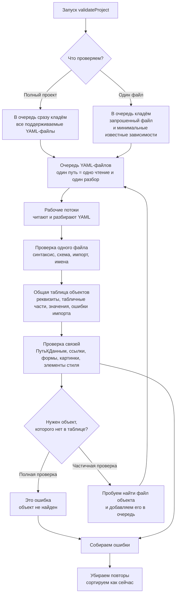

# Параллельная validation через общий YAML snapshot

## Контекст

После кэша контекста discriminated union полная validation большого YAML-проекта ускорилась примерно с 479 до 205 секунд, но всё ещё выполняется последовательно. В профиле остаётся заметная доля YAML parser: около 17% времени. Значит, следующая оптимизация должна не только распараллелить проверки, но и не допустить повторного чтения и разбора одних и тех же YAML-файлов.

Сейчас `validateProject` создаёт один `ProjectYamlCache`, `OwnerMetadataCache`, `ProjectMetadataResolver` и `schemaCache`, после чего проходит найденные файлы циклом. `ProjectYamlCache` читает и разбирает файл лениво, а `OwnerMetadataCache` и `ProjectMetadataResolver` могут дополнительно подтягивать владельцев для `ПутьКДанным` и metadata target ссылок.

## Цели

- Заменить существующий `validateProject` на асинхронную реализацию.
- Для полной validation читать и разбирать каждый поддерживаемый YAML-файл не более одного раза.
- Параллелить CPU-дорогой разбор YAML и независимые проверки.
- Унифицировать полную и частичную validation через одну очередь YAML-файлов и одну таблицу объектов.
- Сохранить формат, сортировку и дедубликацию диагностик.
- Не добавлять знания о конкретных metadata-объектах в общий слой validation.

## Не цели

- Не менять правила `rules.ts`, YAML schema export или импорт моделей без необходимости.
- Не менять набор поддерживаемых YAML-файлов.
- Не делать отдельный публичный `validateProjectParallel`.
- Не переносить `yaml.Document` и `LineCounter` между потоками как основной договор.

## Общая схема



## Единый поток данных

Validation строится вокруг `ValidationYamlQueue`. Очередь хранит состояние по абсолютному пути:

- `pending` — файл известен, но ещё не обрабатывался;
- `running` — файл уже взял рабочий поток;
- `ready` — файл прочитан, разобран и проверен в первом проходе;
- `error` — файл не удалось прочитать или разобрать.

В полном режиме очередь сразу получает результат `discoverValidationProjectFiles(projectDir)`. Поэтому все поддерживаемые `Конфигурация.yaml`, `Свойства.yaml` и `Форма.yaml` читаются и разбираются один раз в параллельном первом проходе.

В частичном режиме очередь начинается с `resolveValidationProjectFile(projectDir, filePath)`. Если проверка связей просит владельца или ресурс, которого ещё нет в таблице объектов, validation пытается найти соответствующий YAML-файл через существующие нейтральные резолверы проекта и добавляет его в очередь. Так частичная проверка не превращается в полный обход проекта, но всё равно использует тот же механизм чтения и таблицу объектов.

Файл закрепляется за одним рабочим потоком на всё время проверки. Этот поток читает файл, разбирает YAML и держит `ParsedYaml` у себя до завершения обеих фаз для этого файла. Основной поток не получает `yaml.Document` и `LineCounter`; он получает только диагностики и сериализуемые записи таблицы объектов.

## Первый проход

Первый проход отвечает за всё, что можно проверить по одному YAML-файлу:

- чтение файла;
- `parseMetadataYaml`;
- диагностики YAML-синтаксиса;
- schema validation через существующий `validateParsedFile`;
- импорт модели из YAML;
- `excludeIfEqualNameYAML`;
- `validateUniqueNameScopes`;
- подготовка записи для таблицы объектов.

Запись таблицы объектов должна быть сериализуемой и не содержать `yaml.Document`. Минимально она хранит:

- путь файла;
- тип ресурса validation: `configuration`, `properties` или `form`;
- владельца: каталог проекта и имя;
- статус импорта;
- модель или лёгкий индекс полей, если модель целиком не нужна вне потока;
- ошибки, которые делают объект непригодным как владелец.

Если модель нельзя безопасно или выгодно передавать между потоками, таблица хранит уже построенный индекс, достаточный для `OwnerMetadataCache` и `ProjectMetadataResolver`.

## Второй проход

Второй проход отвечает за проверки, которым нужны другие объекты:

- `ПутьКДанным`;
- metadata target ссылки;
- существование форм, макетов и вложенных объектов;
- значения перечислений;
- элементы стиля и общие картинки;
- проверки, которые сейчас идут через `ProjectMetadataResolver` и `OwnerMetadataCache`.

Рабочий поток проверяет только свои файлы, но при разрешении связей читает снимок общей таблицы объектов. Таблица не является произвольным разделяемым изменяемым объектом: основной поток собирает записи первого прохода, объединяет их и передаёт рабочим потокам сериализуемый снимок для второго прохода.

Если это полный режим и нужного объекта нет в таблице, возвращается диагностическая ошибка "не найдено". Если это частичный режим, missing-зависимость сначала добавляется в очередь, затем проверка связей повторяется после готовности зависимости и обновления снимка таблицы объектов.

## Граница рабочих потоков

Основной поток отвечает за:

- определение режима полной или частичной validation;
- discovery начального набора файлов;
- управление очередью;
- сбор результатов;
- дедубликацию и сортировку диагностик.

Рабочие потоки отвечают за:

- чтение и разбор YAML;
- компиляцию и переиспользование schema cache внутри потока;
- первый проход по файлу;
- второй проход по файлу с read-only таблицей объектов.

Количество потоков задаётся параметром `concurrency` в `ValidateProjectParams`. Если параметр не задан, используется безопасное значение по числу доступных CPU с верхним пределом, чтобы не увеличить потребление памяти слишком резко.

## Совместимость API

Существующий `validateProject` заменяется на асинхронный:

```ts
const result = await validateProject({ projectDir })
```

CLI уже работает внутри `async` функции, поэтому меняется только вызов. Тесты и внутренние потребители `validateProject` переводятся на `await`.

Для однопоточного поведения в тестах и диагностике можно передать `concurrency: 1`. Результат при `concurrency: 1` должен совпадать с результатом параллельного режима.

## Ошибки и повторяемость результата

Порядок выполнения потоков не должен влиять на итоговый вывод. Все диагностики после параллельных проходов проходят существующие `dedupeDiagnostics` и `sortDiagnostics`.

Если файл не читается, в таблице фиксируется ошибка чтения, а зависимые проверки получают ту же семантику, что и сейчас: либо диагностику файла, либо ошибку ссылки на отсутствующий объект.

Если YAML содержит синтаксические ошибки, второй проход для этого файла не выполняется, но файл остаётся известным очереди, чтобы не пытаться читать его повторно.

## Проверка

- Тест полного проекта: параллельный `validateProject` возвращает те же диагностики, что и режим `concurrency: 1`.
- Тест частичного файла: проверка формы дозагружает свойства владельца, но не читает весь проект.
- Тест повторного чтения: один и тот же YAML-файл не читается и не разбирается дважды при полной validation.
- Тест missing-зависимости: в полном режиме отсутствующий объект сразу даёт ошибку, в частичном режиме существующий объект дозагружается.
- Обновить тесты CLI и validation под `await validateProject`.
- Прогнать `pnpm --filter @nakidka/core type-check` и `pnpm test`.
- Повторить полный validate `/Users/nikita/git/nkdk-yaml` и сравнить время с текущим ориентиром около 205 секунд.

## Риски

Главный риск — преждевременно сделать слишком большой общий индекс объектов. Поэтому первый шаг должен хранить только данные, которые реально нужны существующим проверкам связей. Если для каких-то проверок потребуется полная модель, это лучше явно отразить в договоре таблицы объектов, а не пробрасывать произвольный `ParsedYaml`.

Второй риск — рост памяти на больших проектах. Полный режим намеренно держит разобранные YAML-файлы внутри рабочих потоков до завершения обеих фаз, потому что эти файлы всё равно проверяются. Основной поток при этом хранит только сериализуемую таблицу объектов и диагностики. Для частичного режима очередь остаётся ленивой, чтобы сохранить малое потребление памяти при `--file`.
