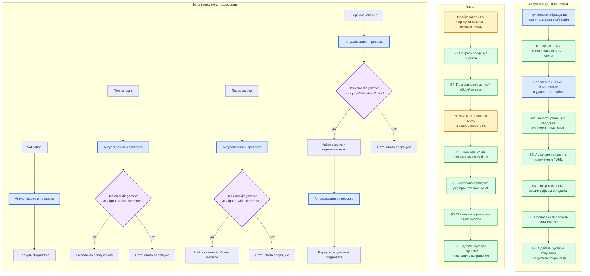

# Двоичное состояние проекта в общей памяти

**Статус:** согласовано для реализации

**Дата:** 2026-08-03

**Версия формата:** `0.4.1`

## Контекст

Текущее состояние проекта хранит хэши файлов, результаты локальной validation и общие индексы в SQLite. На большом проекте холодная validation тратит значительное время на запись примерно 1,21 млн строк и последующее чтение данных для полной проверки зависимостей. Перевод SQLite в режим `:memory:` не устраняет расходы на нормализацию, SQL и массовую запись строк.

Отдельный стенд на миллионе записей подтвердил, что неизменяемый двоичный хэш-индекс можно быстро прочитать с диска в `SharedArrayBuffer`, передать нескольким worker без копирования и искать параллельно. При заполнении таблицы 99% линейное пробирование резко замедляется, поэтому рабочее заполнение ограничивается 80%.

Эта спецификация заменяет SQLite-часть [постоянного состояния проекта](./2026-08-01-validation-project-state-cache-design.md), сохраняя договоры актуализации, операций и [обработки файла внутри validation worker](./2026-08-03-validation-worker-file-processing-design.md). Старый SQLite-кэш не выпускался, поэтому миграция и обратная совместимость не нужны.

## Цели

- Убрать SQLite из состояния проекта во всех сценариях: validation, import, полная sync, поиск ссылок и переименование.
- Хранить рабочее состояние в нескольких `SharedArrayBuffer`, не создавая его полную объектную копию в каждом worker.
- Сохранять все разделы одним двоичным файлом `.nkdk/cache/project-state.bin`.
- Читать и записывать двоичные сведения без промежуточного JSON.
- Сохранить абстрактную границу `ProjectStateStore` и `ProjectStateReadSession`.
- Оставить единственным владельцем изменения состояния главный процесс; worker только читают общие буферы и возвращают двоичные вклады.
- Обеспечить быстрый поиск собственными неизменяемыми хэш-индексами с обязательной проверкой исходного ключа.
- Сохранить текущую семантику хэширования: каждый файл читается в worker, `xxhash64-be-v1` вычисляется по фактическим байтам, а `stat` и `fstat` не используются.

## Не входит в решение

- Миграция `.nkdk/cache/project-state.sqlite` или совместимость с ним.
- Частичная синхронизация. Архитектура не должна мешать её последующему добавлению, но эта задача реализует только полную sync.
- Кэширование результатов полной validation зависимостей: она по-прежнему выполняется для всего проекта при каждой актуализации.
- Изменение публичной семантики `ignoreValidationErrors`.
- Mutation testing.
- Несколько одновременно активных проектов в одном MCP-процессе.
- Изменение компонентного снимка конфигурации, используемого sync.

## Выбранный подход

Рассматривались три варианта.

### (А) Structurae Dictionary и Map как основное хранилище

Отклонён. `MapView` описывает объект с заранее известными полями, а не хэш-таблицу произвольных ключей. `DictView.get()` вызывает последовательный поиск в массиве ключей, поэтому стоимость поиска растёт линейно и не подходит для миллионов обращений.

### (Б) Один файл и один большой `SharedArrayBuffer`

Отклонён. Формат прост, но даже изменение одного логического раздела требует одновременно держать старую и новую полные копии всего состояния. Worker также получают ссылку на разделы, которые им не нужны.

### (В) Один файл, несколько общих буферов и собственные индексы

Выбран. На диске состояние является одним атомарно заменяемым файлом. В памяти оно состоит из нескольких неизменяемых `SharedArrayBuffer`, объединённых одним объектом текущего состояния. Structurae задаёт двоичные представления заголовков и записей, а собственные хэш-таблицы обеспечивают быстрый поиск.

## Состав состояния

Один текущий снимок содержит следующие логические разделы:

| Раздел | Содержимое |
|---|---|
| Заголовок | Сигнатура файла, версия `0.4.1`, порядок байтов, каталог разделов, использованные размеры и контрольная сумма. |
| Строки | Уникальные пути, имена, типы, ключи и тексты diagnostics. Значение хранится один раз и адресуется числовым идентификатором. |
| Файлы | Идентификатор пути, компонент, вид ресурса, роль YAML, восьмибайтовый хэш и состояние локальной validation. |
| Сведения индексов | Объекты, члены, значения, владельцы, поля, формы, ссылки, локальные и отложенные зависимости. Каждая запись содержит идентификатор исходного файла. |
| Поисковые таблицы | Отображения канонических и составных ключей в запись либо непрерывный диапазон записей. |
| Локальные diagnostics | Диагностики синтаксиса, JSON Schema и локальных правил, связанные с исходным файлом. |

На диске разделы последовательно размещены в одном файле. При ленивой загрузке главный процесс читает их в отдельные `SharedArrayBuffer`. Небольшой общий заголовок содержит границы разделов; отдельный JSON-токен для worker не создаётся.

Все связи выражаются числовыми идентификаторами. Путь файла, строковый ключ или текст diagnostic не повторяется в индексных записях. Удаление файла исключает его хэш, локальные diagnostics и все принадлежащие ему индексные сведения из следующего состояния.

Текущее состояние неизменяемо. При актуализации главный процесс строит новый набор нужных разделов рядом с текущим и одной заменой ссылки делает весь набор текущим. Неизменившиеся буферы можно переиспользовать, но отдельного слоя изменений, журнала или нескольких поколений формата нет.

## Роль structurae

Structurae используется только внутри двоичной реализации хранилища:

- описывает фиксированные заголовки и записи;
- создаёт `DataView`-совместимые представления над `ArrayBuffer` и `SharedArrayBuffer`;
- позволяет читать поля записи без декодирования всего раздела;
- не вызывает `toJSON()` и не формирует объектную копию всего состояния.

Схемы представлений объявляются в TypeScript рядом с реализацией формата. Прикладная логика, `ProjectStateStore`, `ProjectStateReadSession` и worker не зависят от классов structurae.

Structurae `Dictionary` и `Map` не используются как основные поисковые структуры. Для поиска создаются собственные неизменяемые таблицы поверх типизированных массивов.

## Поисковые таблицы

Каждая поисковая таблица имеет заранее рассчитанную ёмкость, при которой число занятых ячеек не превышает 80%. Переполнение является ошибкой построителя, а не поводом продолжить работу с деградировавшим поиском.

Ячейка хранит как минимум хэш ключа и идентификатор результата. Поиск выполняется линейным пробированием:

1. вычислить хэш канонического двоичного ключа;
2. найти первую подходящую ячейку;
3. при совпадении хэша сравнить исходный ключ из таблицы строк или составных ключей;
4. вернуть одну запись либо диапазон записей;
5. прекратить поиск на пустой ячейке.

Совпадение хэша без совпадения исходного ключа никогда не считается результатом. Составные ключи имеют однозначное двоичное кодирование с длинами частей, а не соединяются строковым разделителем.

Несколько результатов одного ключа хранятся подряд в отдельном массиве. Хэш-таблица указывает на начало и длину диапазона, поэтому одинаковый ключ не занимает несколько ячеек.

## Границы модулей

Общая логика продолжает зависеть от `ProjectStateStore` и `ProjectStateReadSession`. Двоичная реализация скрывает:

- файл и его проверку;
- распределение сведений по общим буферам;
- structurae-представления;
- построители двоичных разделов;
- хэш-таблицы и правила поиска;
- атомарное сохранение.

`ProjectStateReadSession` сохраняет типизированные пакетные предметные запросы: разрешение целей, чтение владельцев и полей, поиск ссылок, получение входов dependency validation и проекций компонента. SQL, физические смещения и двоичные записи не пересекают эту границу.

Worker получает через Piscina ссылки только на необходимые `SharedArrayBuffer`. Данные не переносятся и не копируются: каждый worker создаёт собственные лёгкие представления над общей памятью. Запись в опубликованные буферы запрещена договором реализации.

Модульная подмена хранилища реализует те же абстрактные договоры и не создаёт настоящий пул Piscina или большой двоичный файл.

## Построение состояния

### Обработка одного файла

1. Worker получает путь и сохранённый восьмибайтовый хэш.
2. Worker читает файл и вычисляет `xxhash64-be-v1` по прочитанным байтам.
3. При совпадении хэша worker освобождает байты и возвращает только признак неизменности.
4. Для изменённого внешнего файла worker возвращает новый хэш и сведения ресурса.
5. Для изменённого YAML тот же worker из уже прочитанных байтов выполняет разбор, локальную validation и извлечение сведений индекса.
6. Worker кодирует результат в ограниченный двоичный вклад и освобождает исходные байты и разобранный YAML.
7. Вклад возвращается главному процессу через Piscina `move()`, `transferableSymbol` и `valueSymbol`. Передача владения `ArrayBuffer` не копирует его.

При сборке итоговых общих буферов главный процесс один раз копирует записи из переданных вкладов в предназначенные разделы. Полной промежуточной JSON- или `Map`-копии состояния не создаётся. Временные поисковые структуры построителя также используют типизированные буферы.

### Сборка нового состояния

Главный процесс:

1. сохраняет сведения неизменённых файлов;
2. исключает удалённые файлы и все принадлежащие им сведения;
3. заменяет вклады изменённых файлов двоичными результатами worker;
4. собирает таблицу строк и нормализованные массивы записей;
5. рассчитывает ёмкости и строит поисковые таблицы с заполнением не выше 80%;
6. создаёт `ProjectStateReadSession` над собранными общими буферами;
7. выполняет полную dependency validation проекта;
8. при отсутствии технического сбоя делает весь набор буферов текущим и запускает сохранение.

Локальные и dependency diagnostics являются содержательным результатом. Их наличие не отменяет публикацию хэшей, индексов и локальных diagnostics. Полные dependency diagnostics возвращаются операции, но не сохраняются. Сбой worker, нарушение двоичного договора, ошибка сборки или иная техническая ошибка отбрасывает незавершённое состояние и сохраняет прежнее.

## Актуализация и пользовательские операции

Одинаково названные этапы Б1–Б6 имеют один смысл в обычной актуализации и import.

### Validation

Validation всегда актуализирует весь проект. Все файлы читаются и хэшируются в worker, но только новые и изменённые YAML разбираются, локально проверяются и заново включаются в индекс. После сборки общего индекса выполняется полная dependency validation. Операция возвращает сохранённые локальные diagnostics неизменённых файлов, новые локальные diagnostics и заново рассчитанные dependency diagnostics.

Публичного ключа отдельного файла или компонента нет.

### Import

Первый проход import продолжает записывать готовые YAML как можно раньше. Worker одновременно формирует двоичные сведения основного индекса и хэш окончательных байтов уже готового файла. После первого прохода главный процесс строит временный неизменяемый индекс в `SharedArrayBuffer` и передаёт его worker второго прохода только для чтения.

Временный индекс на диск не сохраняется. Worker второго прохода уточняют отложенные значения, сразу записывают оставшиеся YAML и возвращают окончательные хэши и локальные diagnostics без повторного чтения файлов. Основной индекс после первого прохода не изменяется. После полной dependency validation главный процесс собирает и публикует окончательное состояние, а затем запускает его сохранение.

### Полная sync

Полная sync всегда начинает с актуализации Б1–Б6. Обычные error-diagnostics блокируют дальнейшую запись, если `ignoreValidationErrors` не равен `true`; техническая ошибка блокирует её всегда. Разрешение продолжить не пропускает validation и не скрывает diagnostics.

Перед фактическим использованием полная sync сохраняет существующую проверку байтов, из которых формируется XML или переносится внешний файл. Состояние проекта не объявляется атомарным снимком файловой системы.

### Поиск ссылок

Поиск ссылок всегда выполняет Б1–Б6, затем обращается к общему двоичному индексу. При `ignoreValidationErrors: true` поиск разрешён несмотря на обычные diagnostics, но возвращает их вместе с предупреждением о возможной неполноте результата.

### Переименование

Переименование выполняет актуализацию дважды:

1. до чтения цели и ссылок;
2. после применения изменений файлов.

`ignoreValidationErrors: true` разрешает продолжить после обычных diagnostics первого прохода, но не пропускает актуализацию. Проверка ожидаемых хэшей затронутых YAML непосредственно перед записью сохраняется. Второй проход выполняется после любой попытки применения и возвращает итоговые diagnostics.

### Будущая частичная sync

Частичная sync в эту реализацию не входит. Её будущая публичная операция должна начинаться с того же полного блока актуализации и читать затронутые файлы и зависимости через `ProjectStateReadSession`; для этого прикладные запросы не должны зависеть от физического порядка разделов.

## Последовательность операций и сохранение

MCP держит один активный проект и загружает его состояние лениво при первом обращении. Переход к другому проекту закрывает прежнее состояние и загружает новый файл.

Поколения и журнал изменений не вводятся. Для одного проекта действует одна очередь изменяющих состояние операций:

1. одновременно выполняется не более одной актуализации или import;
2. после успешной сборки главный процесс заменяет текущий набор буферов;
3. сохранение единого файла запускается асинхронно;
4. следующая изменяющая состояние операция ждёт окончания предыдущего сохранения;
5. чтение уже опубликованного состояния не блокируется фоновым сохранением;
6. при штатном завершении MCP уже начатое сохранение дожидается окончания.

Сохранение записывает заголовок и все используемые части общих буферов во временный файл, завершает запись и атомарно переименовывает его в `.nkdk/cache/project-state.bin`. Прежний файл остаётся доступным до переименования. Для обнаружения случайного повреждения заголовок содержит восьмибайтовую контрольную сумму xxHash64 всего полезного содержимого.

Если фоновое сохранение завершилось ошибкой после возврата результата операции, опубликованное состояние остаётся рабочим в памяти. Ошибка записывается в журнал, а следующая операция повторяет сохранение перед дальнейшим изменением состояния.

## Совместимость и восстановление

Единственный признак совместимости — версия двоичного формата `0.4.1`. Отдельные отпечатки схем, правил или состава метаданных не хранятся. При изменении двоичного устройства либо смысла сохранённых индексов и локальных результатов увеличивается последнее число версии: `0.4.2`, `0.4.3` и далее.

При открытии проверяются:

- сигнатура файла;
- точное совпадение версии;
- допустимость границ и размеров разделов;
- отсутствие пересечений разделов;
- число записей и заполнение поисковых таблиц;
- контрольная сумма.

Файл с другой версией или повреждением удаляется, после чего выполняется холодная перестройка. Незавершённый временный файл после падения процесса также удаляется. Ошибка кэша не становится diagnostic YAML-проекта.

Старый `.nkdk/cache/project-state.sqlite` никогда не читается и не мигрирует. Команда сброса закрывает состояние в памяти и удаляет двоичный, временный и найденный старый SQLite-файл. Следующая обычная операция строит состояние заново.

## Обработка ошибок

| Событие | Результат |
|---|---|
| Локальная ошибка YAML или JSON Schema | Сохраняется для текущего хэша и возвращается операции; новое состояние публикуется. |
| Неразрешённая зависимость | Возвращается полной dependency validation, но не сохраняется; новое состояние публикуется. |
| `ENOENT` при чтении найденного пути | Файл считается удалённым в текущей актуализации. |
| Ошибка чтения, сбой worker или нарушение двоичного договора | Незавершённое состояние отбрасывается, прежнее остаётся текущим. |
| Переполнение поисковой таблицы или заполнение выше 80% | Ошибка построителя; состояние не публикуется. |
| Ошибка временного индекса import | Import прекращается, опубликованное состояние не меняется. |
| Ошибка фонового сохранения | Текущее состояние остаётся в памяти; ошибка журналируется, сохранение повторяется перед следующим изменением. |
| Повреждение дискового файла при загрузке | Файл удаляется, выполняется холодная перестройка. |
| Отмена операции | Новые задания не выдаются, незавершённое состояние отбрасывается. |

## Проверка решения

### Договорные и модульные тесты

Существующий общий набор проверок `ProjectStateStore` и `ProjectStateReadSession` выполняется для двоичной реализации. Тесты прикладной оркестрации используют подмену хранилища и поддельный пул worker.

Обязательные договоры:

- неизменённый файл читается и хэшируется, но его YAML не разбирается;
- изменённый YAML читается один раз и из тех же байтов хэшируется, проверяется и индексируется;
- `stat`, `fstat`, `size`, `mtimeNs`, `dev` и `inode` отсутствуют в потоке;
- Piscina `move()` передаёт двоичный вклад с отчуждением исходного `ArrayBuffer`;
- `SharedArrayBuffer` не копируется и не входит в список переносимых буферов;
- удаление файла удаляет все его вклады;
- коллизия хэша проверяет исходный ключ и не возвращает чужую запись;
- один ключ с несколькими результатами возвращает правильный диапазон;
- построитель не допускает заполнения таблицы выше 80%;
- обычные diagnostics публикуют состояние, а техническая ошибка оставляет прежнее;
- две быстрые актуализации выполняются последовательно и не создают гонку сохранений;
- временный индекс import доступен второму проходу и не записывается на диск.

Желательное время одного модульного теста — до 10 мс, предельное — 50 мс.

### Интеграционные тесты формата

Небольшие тесты во временном каталоге проверяют:

- сохранение и загрузку всех разделов;
- точное восстановление результатов поиска;
- отказ при другой версии, неверных границах и контрольной сумме;
- атомарную замену и сохранность прежнего файла при сбое до переименования;
- удаление состояния командой сброса;
- прямое чтение представлений structurae над `SharedArrayBuffer`.

Интеграционные тесты не создают миллион записей и не запускают настоящий пул Piscina. Они должны оставаться в том же бюджете 50 мс на отдельный тест; измерения больших наборов вынесены из `pnpm test`.

### Измерения

Отдельный измерительный запуск проверяет:

- холодную и прогретую validation `/Users/nikita/git/nkdk-yaml`;
- import и полную sync небольшой конфигурации `/Users/nikita/git/round-trip-compact/cf/all`;
- чтение и запись двоичного файла;
- время миллиона успешных и отсутствующих поисков одним и четырьмя worker;
- максимальную резидентную память главного процесса и worker;
- отсутствие полной копии состояния в памяти каждого worker;
- фактическое заполнение каждой поисковой таблицы.

Холодная validation `/Users/nikita/git/nkdk-yaml` должна завершаться не дольше 2 минут. Миллионные данные и большие каталоги никогда не становятся фикстурами модульных или интеграционных тестов.

### Итоговые проверки

- Mutation testing не запускается.
- `pnpm check:duplicates -- --base 0e5403794b0d6694ee2f33d283cf0011478cb96c` не должен находить новых дублей.
- Перед завершением реализации один раз выполняются `pnpm type-check` и полный `pnpm test`.

## Критерии готовности

Решение готово, когда:

- SQLite удалена из состояния проекта во всех операциях;
- `.nkdk/cache/project-state.bin` является единственным дисковым состоянием проекта;
- во время работы данные находятся в нескольких `SharedArrayBuffer` без полной `Map`- или JSON-копии;
- structurae используется только как двоичное представление, а поиск выполняют собственные таблицы;
- все поисковые таблицы заполнены не более чем на 80% и проверяют исходный ключ после совпадения хэша;
- worker читают общие индексы без копирования и передают новые вклады через Piscina `move()`;
- главный процесс является единственным владельцем сборки и публикации состояния;
- import использует временный неизменяемый индекс только в памяти и сохраняет лишь окончательное состояние;
- validation, полная sync, поиск ссылок и переименование используют общий блок Б1–Б6;
- полная dependency validation выполняется при каждой актуализации и не кэшируется;
- версия `0.4.1` является единственным признаком совместимости;
- повреждённое или несовместимое состояние автоматически удаляется и перестраивается;
- операции и сохранения одного проекта выполняются последовательно без гонок;
- договорные, интеграционные и итоговые проверки проходят в установленных бюджетах.
