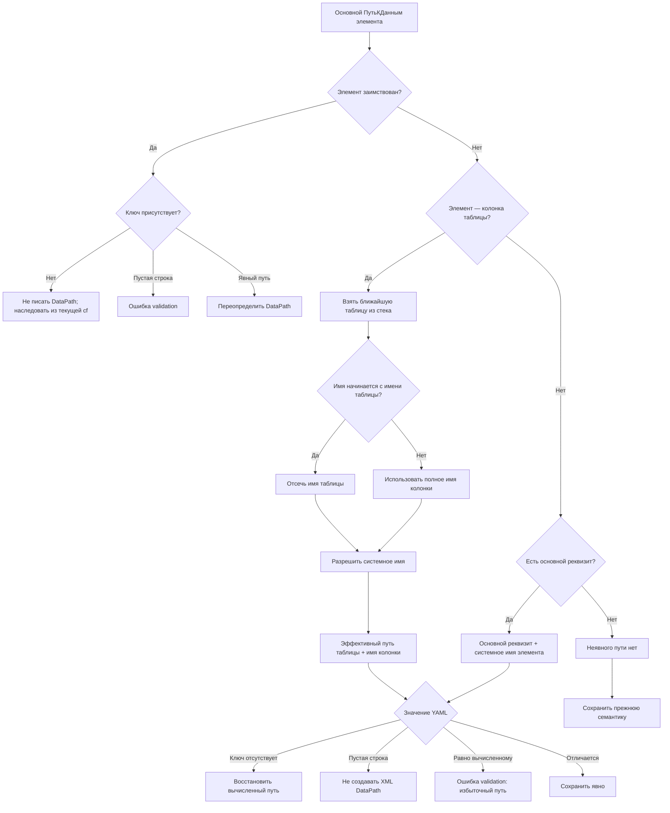

# Дизайн: неявные пути к данным элементов управляемой формы

## Контекст

В XML управляемой формы основной `DataPath` элемента часто однозначно
восстанавливается из структуры формы. Сейчас такой путь всегда попадает в YAML,
хотя не несёт самостоятельной информации.

Для обычного поля распространён шаблон:

```text
Основной реквизит: Объект
Имя элемента: Наименование
XML DataPath: Объект.Description
```

`Наименование` и `Description` обозначают один стандартный реквизит и уже
сопоставляются общим resolver `DataPath`.

Для таблицы и её колонок распространён иерархический шаблон:

```text
Основной реквизит: Объект
Таблица: Таблица                → Объект.Таблица
Колонка: ТаблицаКолонка         → Объект.Таблица.Колонка
Колонка: Наименование           → Объект.Таблица.Description
```

Таблица и колонка могут быть вложены в произвольное число групп формы. Владельцем
колонки считается ближайшая таблица среди предков, а не непосредственный
родитель в YAML.

Исследование 85 250 `Form.xml` из
`/Users/nikita/git/round-trip-compact/cf` обнаружило 80 231 колонку полного
иерархического шаблона в 25 конфигурациях:

- 73 538 совпадений по точным XML-именам;
- 6 693 совпадения через стандартные имена;
- 51 873 непосредственные колонки таблиц;
- 28 358 колонок, вложенных в группы таблиц.

В расширениях значение отсутствующего `DataPath` зависит от происхождения
элемента. У заимствованного элемента отсутствие XML-тега означает наследование
значения текущей формы `cf`. У собственного элемента отсутствие YAML-ключа должно
означать восстановление вычисляемого пути.

В исследованных 60 заимствованных формах расширения найден 161 элемент, у
которого `DataPath` отсутствует и в рабочей части, и во встроенном `BaseForm`, но
присутствует в текущей форме `cf`. Среди них 61 колонка таблицы. Поэтому ни
встроенный `BaseForm`, ни наличие `БазоваяФорма.yaml` не могут определять
семантику отсутствующего пути.

## Цель

Сделать основной `ПутьКДанным` элемента компактным и однозначным:

- не выводить в YAML путь, который вычисляется из основного реквизита и структуры
  элементов формы;
- восстанавливать такой путь при YAML → XML;
- запрещать его избыточную явную запись через validation;
- сохранять различие между собственными и заимствованными элементами;
- использовать один семантический механизм в XML → YAML, YAML → XML и
  validation;
- сохранить линейную сложность обработки формы.

## Границы

Механизм относится только к основному свойству `dataPath` / `ПутьКДанным` /
`DataPath` элемента формы.

Он не применяется к:

- `ПутьКДаннымШапки`, `ПутьКДаннымПодвала` и другим вспомогательным путям;
- свойству `Данные` кнопок;
- формам без эффективного основного реквизита, кроме колонок таблиц с уже
  известным эффективным путём таблицы;
- значениям, которые resolver не смог семантически разрешить.

Новые свойства в общие типы правил и новые параметры `dataPathRule` не
добавляются. `!xml` не используется.

## Семантический договор

### Эффективный основной реквизит

Для обычной формы эффективным основным реквизитом является реквизит с
`ОсновнойРеквизит: Истина`.

Для заимствованной формы используется основной реквизит текущей формы `cf`, если
рабочая форма расширения не объявляет собственного. Встроенный XML `BaseForm` и
сохранённая `БазоваяФорма.yaml` не обязаны содержать признак основного реквизита
и не используются как его источник.

Если основного реквизита нет, неявный путь обычного элемента не вычисляется.

### Происхождение элемента

Сама форма считается заимствованной по существующему договору: форма с тем же
логическим адресом присутствует в `cf`. Наличие `БазоваяФорма.yaml` на это не
влияет.

Элемент заимствованной формы считается заимствованным, если элемент с тем же
именем присутствует в текущей форме `cf` либо в сохранённой
`БазоваяФорма.yaml`. Имена элементов формы уникальны в пределах формы, поэтому
отдельный служебный признак в рабочем YAML не нужен.

Элемент, отсутствующий в обоих источниках, считается собственным, в том числе
если он добавлен расширением внутрь заимствованной группы или таблицы. Элемент,
который сохранился только в `БазоваяФорма.yaml`, остаётся заимствованным, но
получает ошибку validation как отсутствующий в текущей форме `cf`.

### Кандидат обычного элемента и таблицы

Для собственного элемента, который не является колонкой таблицы, кандидат
строится как:

```text
<эффективный основной реквизит>.<семантическое имя элемента>
```

Таблица обрабатывается по тому же правилу. Семантическое internal-имя получает
существующий resolver. Например, `Наименование` преобразуется в `Description`
только тогда, когда это подтверждается типом источника данных.

### Кандидат колонки таблицы

Колонкой считается элемент, ближайший табличный предок которого найден текущим
rule-driven обходом. Группы между колонкой и таблицей не изменяют владельца.
Вложенная таблица начинает новый контекст владения.

Логическое имя колонки определяется так:

1. если имя элемента начинается с имени таблицы и после префикса остаётся
   непустая строка, используется остаток;
2. иначе используется полное имя элемента;
3. полученное имя разрешается общим resolver с учётом источника данных таблицы и
   стандартных имён.

Кандидат строится как:

```text
<эффективный путь ближайшей таблицы>.<internal-имя колонки>
```

Эффективный путь таблицы может быть явным, вычисленным или унаследованным. Если
у таблицы нет эффективного пути либо имя колонки не разрешено семантически,
кандидат колонки отсутствует.

Для собственной колонки внутри заимствованной таблицы эффективный путь таблицы
определяется так:

1. явный непустой путь рабочей таблицы;
2. для собственной таблицы — её вычисляемый кандидат;
3. для заимствованной таблицы с отсутствующим ключом — эффективный путь
   одноимённой таблицы текущей формы `cf`;
4. пустой или неразрешимый путь означает отсутствие кандидата колонки.

Текущая форма `cf` также хранится в компактном YAML, поэтому её эффективный путь
таблицы определяется тем же подготовителем: явное значение сохраняется, а
отсутствующий ключ собственной таблицы восстанавливается из основного реквизита
формы `cf`.

`БазоваяФорма.yaml` не используется как источник пути таблицы.

### Значения YAML

| Происхождение | Значение YAML | Смысл |
|---|---|---|
| Собственный элемент с кандидатом | ключ отсутствует | восстановить вычисленный `DataPath` |
| Собственный элемент с кандидатом | `ПутьКДанным: ""` | не создавать XML-тег `DataPath` |
| Собственный элемент с кандидатом | путь равен кандидату | ошибка validation: избыточная запись |
| Собственный элемент | другой явный путь | сохранить явно |
| Собственный элемент без кандидата | ключ отсутствует | сохранить прежнее отсутствие `DataPath` |
| Заимствованный элемент | ключ отсутствует | не писать XML-тег; оставить наследование из текущей `cf` |
| Заимствованный элемент | `ПутьКДанным: ""` | ошибка validation |
| Заимствованный элемент | явный путь | записать override, даже если он сейчас совпадает с `cf` |

Пустая строка разрешена только собственному элементу с вычисляемым кандидатом:
она различает «восстановить кандидат» и «не создавать `DataPath`». У
заимствованного элемента отсутствие ключа уже имеет самостоятельный смысл
наследования. Надёжный XML-договор явного снятия унаследованного пути в
исследованных расширениях не найден, поэтому пустая строка запрещается.

## Архитектура

### Единый подготовитель формы

Вместо нового обхода вводится единая подготовка на основе существующего
rule-driven обхода `collectFormDataPathOccurrencesFromYAML`:

```text
prepareFormDataPathContextFromYAML({
  yaml,
  currentConfigurationFormYaml?,
  savedBaseFormYaml?,
  rule,
})
```

`currentConfigurationFormYaml` задаёт текущую форму `cf`: по ней определяются
заимствованность, основной реквизит и эффективные пути заимствованных таблиц.
`savedBaseFormYaml` только дополняет множество исторически заимствованных имён.
Для обычной формы оба аргумента отсутствуют.

Результат содержит:

- существующий `FormDataPathIndex` реквизитов, колонок реквизитов и табличных
  элементов;
- найденные значения основного `ПутьКДанным`;
- эффективный основной реквизит;
- происхождение элементов;
- ближайшую таблицу каждой колонки;
- эффективные пути заимствованных таблиц из текущей формы `cf`;
- вычисленные и мемоизированные кандидаты;
- сведения о наличии YAML-ключа отдельно от его значения.

Подготовитель становится общей точкой входа для import, export и validation.
Узкий `collectFormTabularElementsFromYAML`, выполняющий отдельный обход
дерева, заменяется данными общего прохода.

### Однопроходный обход элементов

Обход поддерживает стек текущих таблиц. При входе в таблицу в стек добавляется её
описатель, при выходе удаляется. Группы наследуют текущий контекст без поиска по
родителям. Поэтому определение владельца каждой колонки выполняется за `O(1)`.

Посетитель элемента получает:

- имя и `itemType`;
- YAML-путь;
- наличие основного `ПутьКДанным` и его значение;
- ближайшую таблицу;
- наличие элемента в картах текущей формы `cf` и сохранённой основы.

Обход продолжает определяться через `rules.ts`, поэтому singleton-элементы и
новые виды вложенных элементов не требуют отдельных списков в подготовителе.

### Расширения и `BaseForm`

Переиспользуется существующее разделение источников базовых форм:

- текущая форма `cf` доступна каждой заимствованной форме независимо от наличия
  YAML-спутника;
- `БазоваяФорма.yaml` существует только тогда, когда импортированный встроенный
  `BaseForm` отличается от проекции текущей `cf`;
- отсутствие `БазоваяФорма.yaml` не превращает элементы формы в собственные;
- сохранённая основа дополняет только множество исторически заимствованных
  компонентов и проверяется на совместимость с текущей `cf`.

Отсутствующий путь заимствованного элемента не восстанавливается из
`БазоваяФорма.yaml` и не материализуется в рабочем XML. Платформе передаётся
отсутствующий тег, чтобы она применила наследование текущей `cf`.

Внешняя граница формы один раз собирает `formDataPathContext` из рабочей формы,
текущей формы `cf` и необязательной сохранённой основы, затем передаёт готовый
контекст в `convertClientApplicationFormYAMLToXMLCore`. Общий runtime правил не
узнаёт о `BaseForm` и заимствованных формах.

## Диаграмма решений



## Потоки операций

### XML → YAML

1. Первый проход import полностью формирует смысловой объект формы YAML.
2. Заимствованность формы определяется независимо от наличия встроенного
   `BaseForm`; текущая форма `cf` находится по логическому адресу.
3. Если встроенный `BaseForm` существует, его YAML-кандидат дополняет множество
   исторически заимствованных элементов. Единый подготовитель получает также
   текущую форму `cf` до сериализации рабочей формы.
4. Финализация отложенных `DataPath` рабочей формы преобразует стандартные
   имена и сравнивает фактический XML-путь с кандидатом.
5. У собственного элемента совпадающий путь опускается. Если XML-тег отсутствует
   при наличии кандидата, записывается `ПутьКДанным: ""`.
6. У заимствованного элемента отсутствующий XML-тег остаётся отсутствующим.
7. Остальные пути сохраняются явно.

### YAML → XML

1. Текущая форма `cf` передаётся каждой заимствованной форме независимо от
   наличия `БазоваяФорма.yaml`; сохранённая основа передаётся дополнительно.
2. Подготовитель вызывается один раз до преобразования свойств.
3. Для отсутствующего ключа собственного элемента преобразователь получает
   мемоизированный кандидат.
4. Пустая строка собственного элемента подавляет XML-тег.
5. Отсутствующий ключ заимствованного элемента не создаёт XML-тег и оставляет
   наследование платформе.
6. Явный нестандартный путь проходит через действующий resolver и сериализуется
   обычным механизмом.

### Validation

Validation использует тот же подготовленный контекст и те же канонические
результаты resolver. Она не разбирает имена элементов и таблиц повторно.

Межфайловая validation расширений расширяет существующую структурную проекцию
форм: рабочая форма, сохранённая основа и текущая форма `cf` связываются по уже
используемому логическому адресу. Нового параллельного индекса базовых форм не
создаётся.

Если компонент присутствует в сохранённой основе, но отсутствует в текущей
форме `cf`, validation сообщает ошибку совместимости. До этой ошибки компонент
считается заимствованным, поэтому отсутствие его пути не получает семантику
собственного элемента.

Validation выполняется до полной YAML → XML синхронизации. Поэтому запреты на
избыточный путь и пустое значение заимствованного элемента оформляются
диагностикой validation, а не дублирующей жёсткой ошибкой преобразователя. Явный
режим игнорирования ошибок validation сохраняет существующую ответственность
вызывающей стороны.

## Производительность

Подготовка формы имеет сложность `O(E + D)`, где `E` — число элементов формы, а
`D` — число свойств `DataPath`. Память — `O(E)`.

Для горячего пути обязательны следующие ограничения:

- один rule-driven обход текущей формы;
- не более одного обхода карты текущей формы `cf` и одного обхода имён
  сохранённой основы;
- никакого подъёма по цепочке групп для каждой колонки;
- никакого повторного чтения, разбора или сериализации YAML и XML;
- текущая форма `cf` читается не более одного раза на заимствованную форму,
  включая случай без `БазоваяФорма.yaml`;
- эффективный путь каждой таблицы вычисляется не более одного раза;
- стандартное имя кешируется по источнику данных и логическому имени;
- сравнение уже подготовленного элемента выполняется через `Map` за `O(1)`;
- проектный индекс не перестраивается для отдельного пути.

Профиль на `erp` сравнивает до и после изменения медиану трёх прогонов отдельно
для XML-import, standalone validation и подготовки YAML → XML после одного
прогрева. Допустимое замедление каждого затронутого этапа — не более 5%. Если
шум среды не позволяет использовать жёсткий временной порог в обычном
unit-тесте, профиль остаётся отдельной воспроизводимой проверкой, а unit-тесты
проверяют число обходов и вызовов resolver.

## Диагностика

Добавляются контекстные ошибки:

- собственный элемент явно содержит путь, семантически равный вычисленному;
- заимствованный элемент содержит `ПутьКДанным: ""`;
- компонент сохранённой основы отсутствует в текущей форме `cf`.

Диагностики путей указывают YAML-путь к свойству и вычисленное каноническое
значение. Сравнение выполняется по internal-представлению общего resolver,
поэтому `Наименование` и `Description` не считаются разными путями. Ошибка
совместимости указывает компонент сохранённой основы, отсутствующий в `cf`.

Если основной реквизит, путь таблицы, колонка или стандартное имя не разрешены,
новая диагностика избыточности не создаётся: явное значение обрабатывается
существующей validation, а отсутствие ключа сохраняет прежнюю семантику.

## Тестирование

### Вычисление кандидатов

- обычное поле от основного реквизита;
- стандартный реквизит `Наименование` / `Description`;
- таблица от основного реквизита;
- колонка с префиксом имени таблицы;
- колонка без префикса имени таблицы;
- колонка через одну и несколько групп;
- вложенная таблица начинает новый контекст;
- таблица с явным, вычисленным и отсутствующим путём;
- форма без основного реквизита;
- неразрешимое имя не создаёт кандидат.

### YAML-договор

- отсутствующий ключ собственного элемента восстанавливает путь;
- пустая строка собственного элемента удаляет XML-тег;
- явный вычисляемый путь получает ошибку validation;
- другой явный путь сохраняется;
- XML без `DataPath` импортируется как пустая строка только при наличии
  кандидата.

### Расширения

- заимствованность не зависит от наличия `БазоваяФорма.yaml`;
- отсутствующий путь заимствованного элемента не создаёт XML-тег;
- явный путь текущей `cf` не копируется в рабочую часть расширения;
- элемент только из сохранённой основы остаётся заимствованным и получает
  ошибку совместимости с текущей `cf`;
- собственный элемент расширения использует эффективный основной реквизит
  текущей формы `cf`;
- собственная колонка внутри заимствованной таблицы использует эффективный путь
  этой таблицы из текущей формы `cf`;
- явный путь заимствованного элемента переопределяет наследование из `cf`;
- пустая строка заимствованного элемента отклоняется validation;
- происхождение определяется независимо от глубины групп.

### Общие потребители и round-trip

- XML → YAML → XML для обычной формы;
- XML → YAML → XML для расширения вместе с основной конфигурацией;
- YAML → XML после штатной validation;
- вспомогательные пути и `Данные` кнопок не изменяются;
- один подготовитель используется import, export и validation.

Существующие XML-фикстуры остаются источником истины и не изменяются.

## Критерии готовности

- компактный YAML однозначно восстанавливает основной `DataPath` собственных
  элементов;
- заимствованные элементы сохраняют платформенную семантику наследования;
- колонки корректно находят ближайшую таблицу через группы;
- системные имена разрешаются только общим resolver;
- явная запись вычисляемого пути и пустой путь заимствованного элемента
  диагностируются до XML-синхронизации;
- все потребители используют единый подготовленный контекст;
- профиль крупной конфигурации укладывается в предел 5%;
- `pnpm test`, проверки архитектуры и проверка новых дубликатов проходят перед
  завершением реализации.
