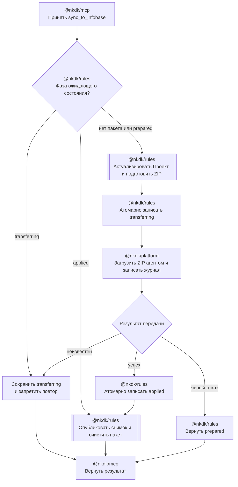

# Частичная синхронизация Проекта с информационной базой

Дата: 2026-08-12
Статус: согласованный проект решения

## Назначение

`nkdk.sync_to_infobase` выполняет полный цикл частичной синхронизации одного
компонента Проекта с основной конфигурацией или расширением информационной базы
1С:

1. подготавливает существующий частичный XML-пакет;
2. передаёт ZIP агенту Конфигуратора;
3. загружает перечисленные в `load.lst` файлы командой
   `config load-config-from-files`;
4. фиксирует снимок компонента только после подтверждённого успеха платформы.

Первый этап поддерживает только агентный режим Конфигуратора. Автономный сервер
не используется. Операция изменяет сохранённую основную конфигурацию
Конфигуратора, но не обновляет конфигурацию базы данных и не запускает режим
1С:Предприятие.

Решение продолжает договор
[частичной синхронизации Проекта в XML](2026-08-09-partial-xml-sync-design.md):
подготовка и фиксация пакета остаются внутренними операциями ядра, а новый MCP-
инструмент становится единственной публичной границей полного цикла.

## Цели

- Добавить один публичный `nkdk.sync_to_infobase` без публичных операций
  `prepare` и `finalize`.
- Переиспользовать существующие ZIP, `load.lst`, снимок-кандидат и migration.
- Переиспользовать подключение, менеджер сессий, служебный каталог агента,
  отмену и журнал платформы из `import_from_infobase`.
- Не фиксировать снимок до подтверждённой загрузки конфигурации платформой.
- Не повторять передачу автоматически, если её результат неизвестен.
- Возвращать краткий безопасный результат и ссылку на подробный локальный
  журнал по тому же договору, что и импорт.
- Поддержать `cf` и `cfe/<Имя>` через один внешний договор.

## Не входит в первый этап

- Загрузка через автономный сервер или `ibcmd`.
- Настройка выбора режима синхронизации в `.nkdk/project.yaml`.
- Обновление конфигурации базы данных после загрузки.
- Запуск 1С:Предприятия и проверка прикладных данных.
- Автоматическое определение результата оборванной передачи.
- Автоматическая повторная загрузка после отмены, тайм-аута или потери
  соединения во время команды платформы.
- Публичные операции ручной подготовки, фиксации или разрешения неизвестного
  результата.
- Автоматический переход от ZIP к распакованному каталогу.
- Включение реальной информационной базы, её копии, выгрузки или журналов в
  репозиторий.

## Выбранный подход

Готовый ZIP копируется в уникальный служебный каталог пользователя агента.
Сессия выполняет команду вида:

```text
config load-config-from-files --archive="<archive>" --list-file="load.lst" --format=hierarchical --partial
```

Для `cfe/<Имя>` добавляется `--extension="<Имя>"`. Пути, передаваемые агенту,
относительны служебному каталогу пользователя; абсолютные пути не передаются.
ZIP содержит `load.lst` в корне, как уже определено договором частичного
пакета.

Параметры `--archive`, `--list-file`, `--format` и `--partial` соответствуют
[команде агента Конфигуратора 1С 8.3.27](https://kb.1ci.com/1C_Enterprise_Platform/Guides/Administrator_Guides/1C_Enterprise_8.3.27_Administrator_Guide/Appendix_4._Startup_command_lines_of_system_components_and_description_of_additional_utilities/4.7._Running_Designer_in_agent_mode/4.7.6._config_group_commands/?language=en).
Совместное чтение `load.lst` из ZIP должно быть подтверждено первым сквозным
экспериментом сразу после реализации минимального построителя команды и
staging. Если платформа его отвергнет, дальнейшая реализация останавливается и
дизайн пересматривается; скрытого перехода к распаковке нет.

Отклонены следующие варианты:

- распаковка ZIP в служебный XML-каталог: создаёт дополнительное состояние и
  усложняет очистку;
- отдельный Конфигуратор в пакетном режиме: обходит уже существующую сохраняемую
  сессию агента и дублирует инфраструктуру импорта.

## Публичный MCP-договор

Инструмент принимает:

```ts
type SyncToInfobaseInput = {
  projectDir: string
  componentPath?: string
  allowWrite?: boolean
}
```

`componentPath` по умолчанию равен `cf`. Поддерживаются `cf` и
`cfe/<Имя>`. Перед любой записью требуется `allowWrite: true`; иначе инструмент
возвращает `confirmation_required` до подготовки пакета и запуска платформы.

Подключение, пользователь, пароль и время простоя читаются из существующего
`.nkdk/project.yaml`. Режим синхронизации на первом этапе фиксирован как
`designer-agent`. Блок `operations.sync` не добавляется. Если сохранённая сессия
импорта была открыта в другом режиме, менеджер заменяет её агентной сессией по
существующему отпечатку подключения.

Успешный ответ имеет два варианта:

```ts
type SyncToInfobaseSuccess =
  | {
      ok: true
      status: "unchanged"
      componentPath: string
      diagnostics: Diagnostic[]
    }
  | {
      ok: true
      status: "synchronized"
      componentPath: string
      packageId: string
      entries: string[]
      loadTargets: string[]
      mode: "designer-agent"
      reusedConnection: boolean
      finalizeStatus: "published" | "alreadyPublished"
      configurationIndexPath: string
      warnings: Diagnostic[]
    }
```

`unchanged` не запускает платформу. `entries` и `loadTargets` возвращают точный
состав применённого пакета, а не только количества. Путь снимка относится к
обновлённому `configuration-index.bin` выбранного компонента.

## Компоненты

### MCP-координатор

Сервис `syncToInfobase` отвечает только за внешний цикл:

- проверяет `allowWrite` и настройки проекта;
- читает состояние ожидающего пакета до новой подготовки;
- вызывает `preparePartialXmlSyncPackage`, если передачу можно начинать заново;
- создаёт каталог и журнал попытки;
- переводит ожидающее состояние между фазами передачи;
- вызывает платформенный менеджер;
- вызывает `finalizePartialXmlSyncPackage` после подтверждённого успеха;
- формирует MCP-ответ и ссылки на сохранённую диагностику.

Планирование XML, validation, вычисление хэшей, запись ZIP и публикация снимка
остаются в ядре и не дублируются в MCP.

### Менеджер платформенных сессий

`PlatformSessionManager` получает операцию загрузки частичного архива. Она
использует существующую очередь проекта, отпечаток подключения, повторное
использование сессии, таймер простоя и журнал. Для операции всегда выбирается
`designer-agent`; автономная сессия не создаётся.

Менеджер возвращает `mode` и `reusedConnection` так же, как импорт. Секреты из
настроек передаются создателю журнала и скрываются во всех сообщениях.

### Сессия агента Конфигуратора

Сессия:

1. проверяет исходный ZIP и его расположение внутри NKDK-проекта;
2. создаёт уникальный staging-каталог внутри служебного каталога пользователя;
3. копирует ZIP без распаковки;
4. захватывает позицию `/Out`-журнала Конфигуратора;
5. выполняет `load-config-from-files`;
6. добавляет в журнал ответ протокола и новый фрагмент `/Out`;
7. удаляет служебную копию ZIP.

Очистка staging после подтверждённого успеха не меняет результат загрузки. Если
удалить служебную копию не удалось, операция продолжает фиксацию снимка и
возвращает предупреждение; оставшийся уникальный staging удаляется при следующем
открытии сессии. Исходный ZIP проекта удаляет только успешный `finalize`.

### Построитель команды

Чистая функция строит команду отдельно от сессии и проверяет управляющие
символы. Архив и список имеют относительные пути. Имя расширения проходит ту же
проверку интерактивного значения, что и остальные параметры агента.

Общая оркестрация не содержит специальных условий по именам объектов
метаданных. Различие между `cf` и `cfe` определяется разобранным адресом
компонента.

## Состояние передачи

Ожидающее состояние частичной синхронизации расширяется фазой доставки:

```ts
type PartialSyncDelivery =
  | { status: "prepared" }
  | {
      status: "transferring"
      attemptId: string
      operationLogProjectPath: string
    }
  | {
      status: "applied"
      attemptId: string
      operationLogProjectPath: string
    }
```

Переходы записываются атомарно. Остальные поля ожидающего состояния, кандидат
снимка и ZIP не меняются.

Формат `pending.json` получает версию 2. Состояние версии 1, оставшееся от
внутренней подготовки предыдущего этапа, читается как `prepared`: публичный
цикл вправе заменить его новой подготовкой. Новые состояния всегда записываются
в версии 2; неизвестная версия остаётся ошибкой и не удаляется автоматически.

```text
нет пакета -> prepared -> transferring -> applied -> finalize -> нет пакета
                              |
                              +-> явный отказ платформы -> prepared
```

Правила повторного вызова:

- при отсутствии пакета выполняется новая подготовка;
- `prepared` можно заменить новой подготовкой: предыдущая попытка явно не
  изменила конфигурацию, поэтому актуальные изменения YAML должны попасть в
  новый ZIP;
- `transferring` означает неизвестный результат предыдущей команды; новая
  подготовка, повторная загрузка и фиксация запрещены;
- `applied` означает подтверждённый успех платформы; повторный вызов выполняет
  только идемпотентный `finalize` и не передаёт ZIP повторно.

Фаза `transferring` записывается до команды агента. После штатного ответа об
ошибке она возвращается в `prepared`. После штатного успешного ответа сначала
публикуется `applied`, затем вызывается `finalize`. Обрыв процесса между
фактическим применением платформой и публикацией `applied` принципиально нельзя
распознать достоверно; сохранённый `transferring` блокирует опасное
автоматическое действие.

## Журнал и ошибки

Каждая попытка передачи использует каталог
`.nkdk/tmp/sync-to-infobase/<attempt-id>` и файл `platform.log`. Журнал имеет
режим `0600` на Unix и тот же формат, что журнал импорта. Он содержит:

- режим, вид подключения и способ аутентификации без секретов;
- начало и завершение поиска платформы, сессии и загрузки конфигурации;
- безопасное представление команды;
- ответ SSH-протокола;
- новый фрагмент `/Out`-журнала Конфигуратора;
- итоговую фазу ожидающего пакета;
- ошибки staging и очистки.

При полном успехе каталог попытки удаляется. При любой ошибке или неизвестном
результате он сохраняется. MCP возвращает краткое очищенное сообщение, этап,
режим, путь каталога, сведения о пакете и `resource_link` на журнал, если журнал
доступен.

Ошибки разделяются по известности результата:

- validation или ошибка подготовки: платформа не запускалась, ожидающее
  состояние не публикуется;
- ошибка staging до команды: пакет остаётся `prepared`;
- штатный отказ `load-config-from-files`: платформа подтвердила неуспех, пакет
  возвращается в `prepared`;
- отмена, тайм-аут, потеря SSH-соединения или завершение процесса во время
  команды: возвращается новый код `delivery_outcome_unknown`, состояние
  остаётся `transferring`;
- ошибка публикации `applied` после успешного ответа платформы также считается
  неизвестным результатом и запрещает повторную загрузку;
- ошибка `finalize` после опубликованного `applied` сохраняет эту фазу; следующий
  вызов повторяет только фиксацию.

Ошибка записи обязательного журнала до команды запрещает передачу. Ошибка
добавления сведений в журнал после начала команды не превращает известный ответ
платформы в противоположный, но сохраняется как предупреждение или причина
недоступности ссылки.

## Отмена и параллельность

Менеджер сохраняет последовательную очередь операций одного проекта. Две
синхронизации одного проекта не выполняются одновременно, даже если выбраны
разные компоненты. Это также исключает одновременную платформенную операцию
импорта в той же сохраняемой сессии.

Отмена до `transferring` завершается как обычная `operation_cancelled`. Отмена
после запуска команды останавливает только принадлежащий NKDK процесс 1С по
существующему договору сессии и возвращает `delivery_outcome_unknown`.

## Актуализация архитектурного монитора

По явному решению разработчика `.agents/architecture.md` обновляется на стадии
планирования как целевая схема этой операции. После реализации схема повторно
сверяется с фактическими публичными границами.

В архитектурном мониторе изменения выражаются таблицей и схемой, без переноса
подробного договора из этой спецификации.

Таблица ответственности фиксирует:

| Пакет | Ответственность в частичной синхронизации с базой |
|---|---|
| `@nkdk/rules` | Актуализация Проекта, план XML, ZIP, снимок-кандидат и атомарные переходы ожидающего состояния |
| `@nkdk/platform` | Сессия агента, staging ZIP, команда 1С, результат передачи и `platform.log` |
| `@nkdk/mcp` | Публичная операция, последовательность вызовов `rules` и `platform`, преобразование результата в MCP-ответ |

Схема операции в архитектурном мониторе показывает границы пакетов и устойчивые
состояния полного цикла:



Заголовок операции и колонка переиспользования изменены на «Частичная
синхронизация с информационной базой». Отдельный архитектурный термин для
внутреннего состояния не добавляется. Схема показывает его русскими предметными
названиями; точные программные идентификаторы остаются в этой спецификации и
коде.

Карта зависимостей пакетов не меняется. MCP не читает внутренние файлы и не
изменяет `pending.json` напрямую: переходы доступны только через публичный API
`MetadataRuntime` / `@nkdk/rules`.

## Проверка на тестовой базе

Проверка разделяется на ранний технический эксперимент и итоговый полный цикл.
Сначала, после минимальной реализации построителя команды и staging, на копии
базы подтверждается, что агент читает `load.lst` из корня ZIP совместно с
`--archive`. До этого результата не реализуются состояния доставки и публичный
MCP-координатор.

После модульных и интеграционных тестов выполняется полный цикл:

1. убедиться, что файл базы не удерживается другим процессом 1С;
2. создать резервную копию каталога базы вне репозитория;
3. создать временный NKDK-проект вне репозитория;
4. записать локальный `.nkdk/project.yaml` со строкой `File`, без пользователя и
   пароля, и с агентным режимом импорта;
5. импортировать `cf` из базы и получить исходный снимок;
6. добавить в YAML справочника `Справочник1` реквизит `ТестовыйРеквизит` типа
   `Строка` длиной 50;
7. вызвать `nkdk.sync_to_infobase` с `allowWrite: true`;
8. проверить точные `entries`, `loadTargets`, успешный ответ агента и увеличение
   поколения снимка;
9. повторно выгрузить основную конфигурацию через агент в новый временный
   проект и подтвердить реквизит в YAML;
10. повторный sync должен вернуть `unchanged`.

Повторная выгрузка проверяет сохранённую основную конфигурацию Конфигуратора;
обновление конфигурации базы данных для критерия успеха не требуется. После
успеха реквизит остаётся в тестовой базе. Резервная копия используется только
при проблемах и не удаляется автоматически.

База, её копия, временные проекты, XML/YAML-выгрузки, ZIP и журналы находятся
за пределами worktree и Git. Тестовые фикстуры проекта синтетические и не
создаются из содержимого реальной базы. Спецификация и тесты не фиксируют
абсолютный локальный путь к базе.

## Автоматическая проверка

Модульные тесты покрывают:

- точную команду для `cf` и `cfe`, экранирование и запрет управляющих символов;
- атомарные переходы `prepared`, `transferring` и `applied`;
- запрет подготовки, загрузки и фиксации из `transferring`;
- повтор только `finalize` из `applied`;
- возврат в `prepared` после явного отказа платформы;
- сохранение ZIP и кандидата до успешного `finalize`;
- staging ZIP без распаковки и очистку служебной копии;
- очистку старого уникального staging при следующем открытии сессии;
- выделение нового фрагмента `/Out`-журнала;
- скрытие паролей и безопасную ошибку при недоступном журнале;
- контракт входа, подтверждение записи и оба успешных ответа MCP;
- `delivery_outcome_unknown` для отмены, тайм-аута и потери соединения;
- подробности ошибки: этап, режим, каталог операции, пакет и ссылка на журнал.

Интеграционные тесты покрывают:

- `prepare -> agent load -> applied -> finalize`;
- отсутствие вызова платформы для `unchanged`;
- повторную подготовку после штатного отказа;
- восстановление фиксации после ошибки между `applied` и завершением `finalize`;
- блокировку после имитации аварийного завершения в `transferring`;
- `cf` и `cfe/<Имя>` без условий по конкретным видам метаданных;
- сериализацию platform-операций общей очередью проекта;
- сохранение подробного журнала при ошибке и его удаление при успехе.

Главный критерий готовности: сквозной вызов добавляет строковый реквизит в
сохранённую основную конфигурацию тестовой файловой базы через агентный режим,
фиксирует снимок только после успеха и затем возвращает `unchanged` без новой
команды платформы.

Перед завершением реализации выполняются `pnpm duplicates -- --base <commit>`,
`pnpm test:architecture:rules`, `pnpm test:architecture` и полный `pnpm test`.
После этих проверок `.agents/architecture.md` сверяется с фактическими именами
публичных операций и состояниями; если реализация разошлась со схемой,
расхождение сначала согласуется, а не скрывается правкой монитора.
