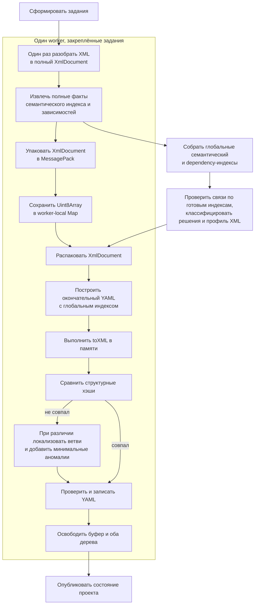

# Двухпроходный импорт XML с компактным DOM в памяти

## Цель

Ускорить полный XML → YAML импорт и удержать Peak RSS полного импорта ERP в пределах 4 ГиБ, не меняя публичные XML/YAML-договоры и точность round-trip.

Импорт читает каждый XML-файл с диска один раз. Первый проход только строит полный семантический индекс и индекс зависимостей непосредственно из XML, а затем сохраняет разобранный XML в компактном двоичном виде. Записи индекса зависимостей содержат данные для будущих проверок, но сами проверки в worker первого прохода не выполняются. После объединения индексов отдельный барьер проверяет связи и классифицирует межфайловые решения. Второй проход на том же worker восстанавливает XML-объект, строит окончательный YAML с готовыми решениями, выполняет контрольный toXML, один раз записывает YAML и сразу освобождает данные задания.

## Исходное состояние

Контрольный профиль ERP выполнен свежесобранным MCP через stdio с четырьмя worker:

- 38 455 заданий, 0 ошибок, 4 предупреждения;
- полное время — 1 224 062 мс, или 20 минут 24 секунды;
- второй проход — 930 980 мс, 76% полного времени;
- повторное подробное чтение потребовалось для 26 157 заданий, 68% каталога;
- контрольный экспорт всех 38 455 заданий использовал прямой объектный путь, без сериализованного fallback;
- Peak RSS с подробным профилированием — 4 965,8 МиБ, Peak Heap — 2 376 МиБ.

Текущий первый проход строит предварительный YAML и сохраняет его во временную LMDB. Во втором проходе исходный XML при необходимости читается повторно. При несовпадении контрольный экспорт материализуется в XML-строку и снова разбирается, хотя исходный и экспортированный документы уже представлены объектами.

Отдельно выявлена ошибка инструментов MCP: длительная команда возвращает `status: accepted`, а текущие round-trip и import-profile принимают этот ответ за окончательный результат, закрывают MCP-сессию или начинают следующую стадию. Поэтому прежний профиль мог ложно показывать около 1,2 секунды и нулевые стадии.

## Критерии результата

Для полного ERP-прогона:

- Peak RSS не превышает 4 ГиБ в обычном измерительном режиме;
- время импорта воспроизводимо меньше текущего compiled-MCP baseline; минимальный обязательный процент ускорения не задаётся;
- итоговые diagnostics и round-trip совпадают с исходным поведением;
- YAML и XML-аномалии совпадают со старым импортом из `5020f2369c43085f1e1919e1f51624eef6223432` на одинаковом входном XML;
- XML каждого задания читается с диска только в первом проходе;
- контрольный экспорт не сериализуется в XML-строку для сравнения.

Разработка и частые замеры выполняются на `/Users/nikita/git/round-trip-compact/cf/doc`. ERP используется только для итогового контроля, поскольку один прогон занимает 20–30 минут.

## Общая схема

## Первый проход: факты без YAML

Совместимый XML-парсер по-прежнему создаёт полный `XmlDocument`: совместимый объект, адресуемое дерево, порядок узлов, атрибуты, текст и структурные хэши. Потоковый расчёт XXH3 остаётся частью чтения.

Из текущего обхода rules.ts выделяется режим `facts-only`. Он использует те же правила выбора metadata item и XML-варианта, но не создаёт:

- YAML-объект и YAML-текст;
- audit и аннотации;
- предварительный prepared record;
- данные, которые нужны только для отображения YAML.

Режим возвращает только сведения, необходимые до построения окончательного YAML:

- объекты, поля и локальные идентификаторы для configuration index;
- цели, владельцев, поля, формы и логические адреса семантического индекса;
- записи dependency-индекса для ссылок, `fillValue` и путей форм;
- сведения для профиля восстановления XML;
- XML-варианты и адресуемые повторы, влияющие на последующий fromXML/toXML;
- внешние файлы и части снимка компонента, обнаруживаемые из данного задания.

Эквивалентность фактов проверяется не против предварительного состояния нового импорта, а против семантического вклада, который старый импорт получает после построения полного YAML. Для одного и того же задания должны совпадать цели, владельцы, поля, формы, логические адреса и записи dependency-индекса. Режим не становится новым набором предметных правил: это отдельный способ выполнения существующего обхода и формирования входных данных общих анализаторов зависимых значений.

Первый проход не вызывает валидаторы, не ищет цели в ещё неполном индексе и не классифицирует `!xml/invalid` или `!xml/important`. Он не должен ни терять индексные записи, которые старый импорт получает из полного YAML, ни добавлять задания проверки, которых старый импорт для этого metadata item не выполняет.

## Компактное worker-local хранилище

После извлечения фактов `XmlDocument` кодируется `msgpackr` в самостоятельный `Uint8Array`. `msgpackr` добавляется как прямая зависимость пакета, а не используется транзитивно через LMDB.

Перед реализацией основного хранилища на `cf/doc` сравниваются настройки codec. Выбранная настройка обязана:

- сохранять `BigInt`, порядок массивов, пустые значения и все виды XML-узлов;
- сохранять или восстанавливать совместное использование общего compatibility-объекта, не размножая его для каждого узла;
- давать независимый буфер, достаточный для распаковки тем же worker;
- не держать ссылки на исходное объектное дерево после упаковки.

Базовый кандидат — `Packr` со structured-clone references и record structures. Если эта комбинация не даёт выигрыша, выбирается лучшая конфигурация `msgpackr` по времени, размеру и Peak RSS, но формат остаётся внутренним и версионируется вместе с кодом.

Каждый worker хранит свои буферы в `Map<assignmentId, Uint8Array>`. Координатор не получает буферы и не копирует их между потоками. Планировщик второго прохода возвращает каждое задание тому же worker. При падении worker операция завершается ошибкой: восстановление его буферов повторным чтением XML в первой версии не выполняется.

Первая версия не использует LMDB, временные файлы и spill для этих XML-буферов. Если лимит памяти не будет достигнут, следующая гипотеза рассматривает специализированный двоичный XML DOM за тем же интерфейсом хранилища.

## Глобальные индексы и барьер решений

Координатор объединяет факты первого прохода и фиксирует configuration index, семантический индекс и индекс зависимостей. Только после этого отдельная стадия проверяет связи по полному снимку, классифицирует межфайловые ошибки и строит профиль восстановления XML. Worker получают неизменяемый снимок, готовые решения или существующие токены доступа к индексам; крупные индексы не копируются в результат каждого задания.

Все межфайловые решения, влияющие на представление YAML, должны быть получены до второго прохода. Локальные проверки, которым нужен уже построенный YAML, выполняются внутри второго прохода до записи файла. Ни одна проверка не должна требовать чтения уже записанного YAML или третьего построения YAML.

Полнота первого прохода закрепляется тремя найденными группами:

- вложенный `MetadataCommonForm` не получает проверки самостоятельной `ClientApplicationForm`; общая форма сохраняет те же цели и владельца, что старый импорт;
- ссылки с договором `translateOnly`, включая `ТабличнаяЧасть.…СтандартныйРеквизит.Ссылка`, сохраняются для перевода и поиска ссылок, но не становятся заданиями проверки существования и не получают лишний `!xml/invalid`;
- для реквизита с `DefinedType` первый проход сохраняет запись `fillValue` в dependency-индексе, а проверка после общего барьера назначает несовместимому значению тот же `!xml/invalid`, что в старом импорте.

## Второй проход: окончательный YAML и контрольный экспорт

Для каждого закреплённого задания worker последовательно:

1. распаковывает исходный `XmlDocument`;
2. выполняет полный fromXML с готовыми глобальными индексами и полным audit;
3. строит окончательный YAML;
4. выполняет toXML в объектное представление;
5. сравнивает исходный и экспортированный документы;
6. добавляет минимальные XML-аномалии только для различающихся ветвей;
7. применяет готовые межфайловые решения и решения локальной проверки;
8. сериализует в памяти и один раз записывает окончательный YAML;
9. возвращает окончательный вклад задания в состояние проекта;
10. удаляет packed buffer и освобождает исходное и экспортированное деревья.

Одновременно распакованными остаются только задания текущей ограниченной пачки worker. Освобождение выполняется в `finally`, включая ошибки, отмену и остановку операции.

Проверка может повторно сериализовать ещё не записанный объект в памяти, если локальное решение меняет аннотацию, но файловая система получает только окончательный вариант. Записанный YAML повторно не читается и не перезаписывается.

## Сравнение без XML-строки

Исходный SAX-парсер уже вычисляет структурные XXH3-хэши. `xmlObjectRootStructures` уже умеет вычислять такие хэши непосредственно по результату toXML; в ERP все контрольные экспорты прошли по этому direct-пути.

Новый путь сначала сравнивает хэши корней. При совпадении дополнительные преобразования не выполняются. При несовпадении экспортированный адресуемый документ строится прямо из объектного результата toXML, без XML-сериализации и повторного парсинга. Рекурсивное сравнение спускается только в ветви с разными хэшами.

Минимальные `!xml`-аннотации формируются из сохранённого исходного `XmlDocument` и существующего audit. Новые классы применения `!xml` эта работа не вводит. Результат локализации должен совпадать с текущим anomaly proof на существующих тестах.

## Измерение toXML

Оптимизация самого toXML не входит в первую реализацию. До отдельного решения профиль разделяет его на:

- построение объектного XML из YAML;
- отложенную финализацию правил;
- расчёт прямого структурного хэша;
- сравнение корней;
- построение адресуемого экспортированного дерева при несовпадении;
- локализацию различающихся ветвей.

Также измеряются время и объём MessagePack pack/unpack, число удерживаемых буферов, суммарный packed size и Peak RSS по стадиям. Если построение объектного XML окажется значимой долей времени, его алгоритм разбирается отдельной спецификацией после проверки первой версии.

## Исправление асинхронного MCP round-trip

Исправление runner выполняется первым слоем, иначе измерения и round-trip недостоверны.

В `.agents/tools/mcp/call.mjs` вводится общий вызов длительной операции:

1. команда запускается в существующей MCP-сессии;
2. ответ `{ status: "accepted", operationId, projectDir }` распознаётся как начало, а не завершение;
3. та же сессия опрашивает `nkdk.get_operation` с ограниченным интервалом;
4. состояния `queued` и `running` продолжают ожидание;
5. только `succeeded` возвращает вложенный `result` вызывающему коду;
6. `failed`, `cancelled`, `interrupted`, закрытие транспорта и некорректный снимок завершают команду ошибкой;
7. в успешном снимке дополнительно проверяются `result.ok === false` и `result.failed`, кроме уже разрешённых `project_validation`;
8. stderr MCP накапливается до терминального состояния и включается в диагностику ошибки;
9. при SIGINT/SIGTERM runner запрашивает `nkdk.cancel_operation`, дожидается ограниченное время и закрывает сессию.

Round-trip получает небольшой JS-координатор, который в одном процессе MCP последовательно выполняет import и sync. Sync не может начаться до успешного терминального результата import. Для нескольких конфигурационных каталогов сессия также переиспользуется.

`import-profile.mjs` использует тот же общий механизм ожидания и одну сессию для серии прогонов. Время, стадии и diagnostics берутся из терминального результата, а не из `accepted`.

Оба инструмента перед запуском собирают текущий `@nkdk/mcp` и по умолчанию запускают compiled-сервер из той же рабочей копии. Это гарантирует последнюю версию кода и исключает измеренную надбавку исходного TypeScript runner. Исходный режим остаётся только средством отладки.

## Ошибки и отмена

- Ошибка первого прохода запрещает фиксацию глобальных индексов и запуск второго прохода.
- Повреждение или несовместимость packed buffer завершает импорт с указанием задания; YAML и состояние проекта не публикуются.
- Падение worker завершает операцию и очищает буферы остальных worker.
- Ошибка второго прохода не оставляет частично опубликованное состояние; временные YAML обрабатываются существующей транзакционной границей импорта.
- Отмена проверяется между заданиями и внутри длительных стадий; `finally` освобождает локальное хранилище.
- Ошибка MCP operation никогда не маскируется внешним успешным ответом `accepted`.

## Проверки

### Модульные

- codec round-trip для полного `XmlDocument`: `BigInt`-хэши, порядок, атрибуты, processing instructions, пустые элементы, `xsi:nil`, compatibility references;
- владение worker-local store, получение только своим worker и гарантированное освобождение;
- равенство полного facts-only вклада и вклада старого полного YAML: targets, owners, fields, forms, logical addresses и записи dependency-индекса;
- отсутствие проверки самостоятельной формы у вложенного `MetadataCommonForm`;
- отсутствие задания проверки существования для `translateOnly`-ссылки на стандартный реквизит вложенной табличной части;
- сохранение индексной записи `fillValue` для реквизита с `DefinedType` и её проверка только после общего барьера;
- равенство прямых структур экспортированного объекта прежнему serializer/parser-пути;
- спуск mismatch walker только в различающиеся ветви и прежние минимальные аномалии;
- MCP-переходы `accepted → queued → running → succeeded`;
- вложенные `ok: false` и недопустимые `failed`, а также `failed`, `cancelled`, `interrupted` и закрытие транспорта;
- строгая последовательность import → terminal success → sync.

### Интеграционные на `cf/doc`

- итоговый YAML новой и исходной реализации совпадает;
- импорт создаёт 9 937 результатов, 0 ошибок и то же единственное предупреждение, что контрольный старый импорт;
- отсутствуют 131 лишний тег ссылок, 12 нетегированных несовместимых FillValue и каскад CommonForm;
- экспортированный XML не имеет новых semantic/triage diff;
- diagnostics не изменились;
- счётчик чтений подтверждает отсутствие повторного чтения XML;
- сравниваются cold elapsed, стадии, Peak RSS, packed bytes и pack/unpack time;
- round-trip действительно ждёт обе фоновые операции и возвращает их итоговые отчёты.

### Итоговые на ERP

- полный compiled-MCP импорт с Peak RSS не более 4 ГиБ;
- воспроизводимое ускорение относительно зафиксированного baseline;
- 0 ошибок импорта и те же допустимые предупреждения;
- чистый round-trip либо прежний согласованный список расхождений без новых diff.

Подробное событие-по-событию профилирование памяти запускается отдельно: оно само увеличивает потребление и не используется как единственная проверка лимита 4 ГиБ.

## Последовательность внедрения

1. Исправить ожидание фоновых MCP-операций в round-trip и import-profile.
2. Добавить недостающие стадии и счётчики профиля.
3. Выбрать конфигурацию MessagePack на `cf/doc` и закрепить codec тестами.
4. Выделить facts-only обход и доказать эквивалентность полного семантического вклада старому YAML-пути.
5. Перевести импорт на worker-local packed store и закреплённый второй проход.
6. Удалить повторный XML parse и serializer/parser из direct control export.
7. Проверить `cf/doc`, затем выполнить итоговый ERP-прогон.

## Не входит в работу

- специализированный двоичный XML DOM;
- spill packed buffers на диск;
- изменение формата YAML, XML или публичного MCP-ответа;
- новые применения `!xml`;
- увеличение числа worker как способ ускорения;
- оптимизация toXML без подтверждающего профиля;
- восстановление потерянных буферов после падения отдельного worker.
